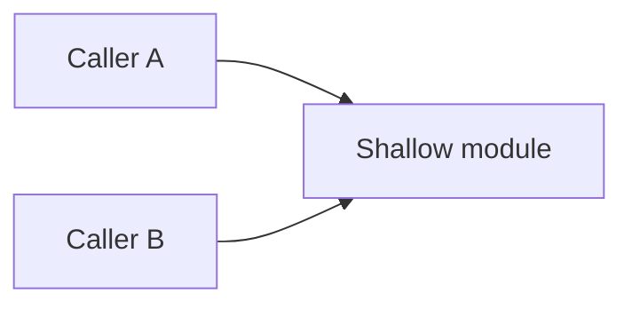
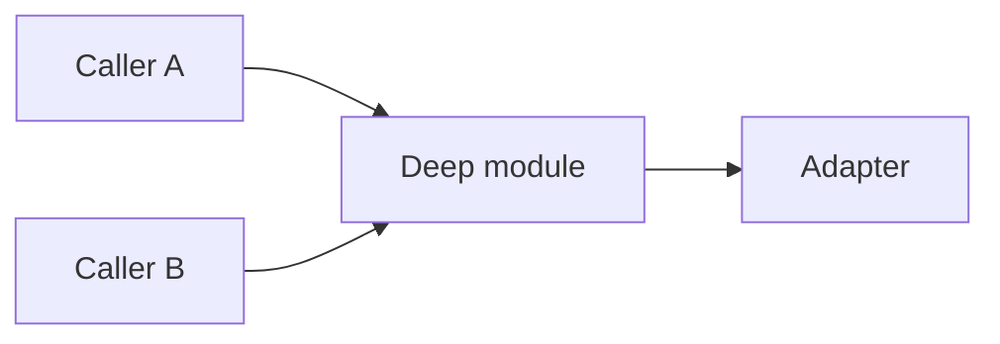

# 架构评估报告模板

## Markdown 模板

~~~markdown
# 架构深化候选

## 总览

| 候选 | 推荐强度 | 主要收益 | 风险 |
| --- | --- | --- | --- |

## 候选一：<名称>

### 文件/模块

- <path or module>

### 当前摩擦

- <真实维护、测试、导航或缺陷摩擦>

### 建议深化

- <要形成的深模块或 seam>

### Before



### After



### 收益

- 局部性：
- 杠杆：
- 测试：

### 风险与迁移

- 风险：
- 第一切片：
- 回滚：
~~~

## HTML 报告

只有用户要求可视化或候选很多时再生成临时 HTML。文件写到系统临时目录，例如：

```text
<temp>/architecture-review-<timestamp>.html
```

不要把一次性报告放进仓库，除非用户明确要求保留。
