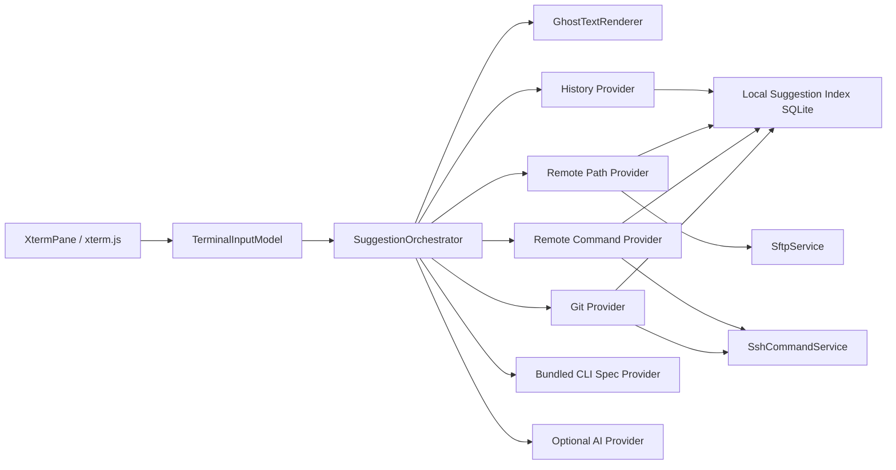

# ADR-0010: 生产级 SSH 终端命令灰色提示架构

## 状态

Proposed

## 背景

Kerminal 要在远程 SSH 交互终端中实现类似 fish/zsh autosuggestion 的灰色命令提示：用户输入命令前缀后，在光标后方显示可接受但尚未写入终端的建议文本。用户明确要求这是长期使用的生产级产品能力，不是 MVP demo；唯一硬约束是不要求用户在远端主机安装 fish、zsh 插件、shell integration 脚本、agent 或其他常驻组件。远端主机可能没有互联网能力，因此所有完成规格、模型、缓存、索引和更新机制都必须能在本地离线工作；远端只需要已有 SSH/SFTP 通路。

当前项目事实：

- React 侧使用 `@xterm/xterm`；`XtermPane` 在 `terminal.onData` 中把用户输入直接写入 `terminal_write`。
- Rust 侧 `TerminalManager` 使用 `portable-pty` 管理本地 PTY，会话输出通过 Tauri Channel 推给前端。
- SSH 交互会话由 `SshTerminalService` 启动本机 OpenSSH 客户端并接入同一套 `TerminalManager`，不是远端 agent。
- 非交互 SSH 命令已有 `SshCommandService`，SFTP 已有 `SftpService::list_directory`、文件读取、stat 等能力。
- 命令历史已经记录 `target`、`remote_host_id`、`cwd`、`shell`、`source`，适合作为生产建议引擎的基础索引。

外部调研结论：

- `fish` 和 `zsh-autosuggestions` 的灰色提示体验成熟，但属于 shell 内部/插件能力，需要用户 shell 支持或修改 shell 初始化文件，不满足本产品约束。
- VS Code terminal suggest 基于 xterm 和 shell integration 获取 prompt/input 状态；官方文档说明普通 SSH 会话自动注入 shell integration 不可靠，通常需要手动安装。
- Fig/Amazon Q 的 completion spec 生态适合离线打包 CLI 规格；Amazon Q inline completion 也说明生产级建议会结合当前 shell context 和近期历史。
- Ghost Complete 证明 PTY proxy 可以做完整终端补全，但它重写输入输出路径，适合独立终端补全工具，不适合作为 Kerminal 当前架构的第一选择。
- Atuin、McFly 证明 SQLite 历史、cwd、exit status、frecency 和上下文排序是长期可维护的历史建议基础。
- `nucleo` 是成熟的 Rust fuzzy matcher，可用于大历史量和文件候选排序。

## 决策驱动因素

- **零远端安装**：不能要求远端主机安装 shell 插件、agent、Node、Python、fish/zsh 或联网下载内容。
- **离线可用**：远端无互联网时，历史、规格、路径、Git、可执行文件建议仍能工作；AI 只作为本地或联网可选 provider。
- **终端正确性**：提示文本不能写入 PTY、不能污染 scrollback、不能破坏 shell 补全、vim/tmux/top 等全屏程序或鼠标模式。
- **准确性**：长期目标不是只按历史前缀猜测，而是综合本地历史、远端文件系统、远端 Git 状态、远端 PATH/命令、CLI specs、别名和可选 AI。
- **性能**：按键同步路径必须极轻；不允许每次按键触发远端命令、SFTP 请求或 LLM 请求；远端上下文必须后台索引和缓存。
- **安全隐私**：命令历史、远端文件名、Git 分支、环境变量和 AI prompt 都要有 provider 级开关、敏感过滤、审计和本地优先策略。
- **可维护性**：保持 `XtermPane`、`TerminalManager`、`SshCommandService`、`SftpService` 的边界，不为了补全重写 SSH 交互通道。

## 备选方案

| 方案 | 优点 | 缺点 | 风险 | 验证方式 |
| --- | --- | --- | --- | --- |
| 远端 shell 插件，安装 fish/zsh-autosuggestions | 行为最接近 shell 原生；准确处理编辑缓冲区 | 违反零远端安装；无法覆盖受限服务器 | 企业环境不可接受，用户环境被污染 | 不作为 Kerminal 内建方案 |
| 远端 shell integration/OSC 协议 | 可获得 prompt、cwd、命令边界和 exit status | 仍需远端脚本或 shell init 注入 | 多 shell、多 prompt 兼容成本高 | 只作为未来可选增强，不作为生产默认 |
| PTY proxy 类似 Ghost Complete | 可完整拦截输入输出；可渲染 ANSI overlay | 侵入 IO 路径，回归面大 | 全屏程序、粘贴、鼠标、转义序列风险高 | 作为长期实验分支，不替代当前架构 |
| 本地输入模型 + 前端 ghost overlay + 本地/远端上下文 provider | 不改远端；复用现有 SSH/SFTP/SQLite；离线可用；风险可控 | 需要构建自己的输入模型、索引和 provider 管线 | 复杂行编辑和特殊 prompt 需要保守降级 | 前端模型测试、provider 测试、SSH/SFTP smoke、性能基准 |

## 决策

采用“本地输入模型 + xterm 旁路渲染 + Provider 编排 + 本地持久索引 + 受控远端探测”的生产架构。

### 运行时架构

### Provider 分层

生产版内建以下 provider，按风险和稳定性分级启用：

| Provider | 默认 | 数据来源 | 是否需要远端联网 | 说明 |
| --- | --- | --- | --- | --- |
| History | 开启 | Kerminal SQLite 历史、可选导入远端 shell history 文件 | 否 | 核心 provider，按 host/cwd/session/source/frecency 排序 |
| Remote Path | 开启 | SFTP list/stat、本地 TTL 缓存 | 否 | 支持 `cd`, `ls`, `cat`, `vim`, `scp` 等路径候选 |
| Remote Command | 开启 | 受控 SSH 命令采集 `$PATH`、shell builtins、alias/function 摘要 | 否 | 连接后后台低频探测，不在按键路径执行 |
| Git | 开启 | 受控 SSH 命令读取当前 repo branch/tag/remote/status 摘要 | 否 | 只在检测到 Git workspace 时采集，TTL 和超时严格限制 |
| CLI Specs | 开启 | 本地随应用打包的 Fig-compatible 静态 specs 子集 | 否 | 覆盖 git/docker/npm/cargo/kubectl/ssh/systemctl 等常用 CLI |
| AI | 关闭 | 本地或用户配置的模型服务 | 取决于配置 | 只做 opt-in，不作为基础准确性依赖 |

### 输入和渲染

- `TerminalInputModel` 是前端纯逻辑模块，消费 xterm `onData`/`onKey`，维护当前命令行文本、光标、选择、粘贴、提交、取消和 buffer 状态。
- `GhostTextRenderer` 使用 DOM overlay 作为生产默认，不调用 `terminal.write` 展示提示；接受时只把后缀写入 `terminal_write`。
- 只在 `normal buffer`、单行或可确定续行、光标位于行尾、未选择文本、未粘贴、未运行全屏程序时显示 ghost text。
- Tab 默认继续发给远端 shell；右方向键默认接受整条建议；可配置 `Alt+Right` 接受单词。

### 本地索引和缓存

- 新增 `command_suggestion_candidates` 或等价视图/表，聚合历史、远端路径、远端命令、Git refs、spec entries。
- 候选记录必须带 `provider`、`target_key`、`remote_host_id`、`cwd_scope`、`text`、`replacement`、`score_features`、`last_seen_at`、`ttl_expires_at`、`sensitivity`。
- 远端上下文按 host/cwd/provider 分片缓存；过期缓存可展示但降权，并异步刷新。
- 按键路径只查本地内存快照或 SQLite 索引，不触发远端 IO。

### 远端采集原则

- 允许使用现有 SSH/SFTP 连接能力执行短生命周期、只读、受控命令或目录列表，因为这不要求远端安装任何东西。
- 采集命令必须有超时、输出上限、并发上限、静默失败和审计标签。
- 不读取大型目录、不递归全盘、不扫描敏感目录；默认只采集当前 cwd、父目录、最近访问目录和用户显式打开的 SFTP 目录。
- 可选导入远端 shell history：读取 `.bash_history`、`.zsh_history`、fish history 等只读文件前需要用户设置允许；导入后走本地敏感过滤。

### 评分和合并

生产评分不只看前缀：

1. 当前输入 token / cursor position / command position。
2. 当前目标类型、`remote_host_id`、cwd、session。
3. 历史 frecency、成功率、最近一次 exit status、来源类型。
4. Provider 置信度：spec > exact history > cwd path > git ref > fuzzy history > AI。
5. CLI 语法位置：subcommand、option、option value、path、remote ref。
6. 安全策略：危险命令、secret、生产主机、AI 生成内容降权或需要显式接受。

### 离线策略

- 应用包内随版本携带静态 specs 和内置命令规则，不依赖运行时下载。
- 用户可导入/导出 specs 包，供无互联网环境离线更新。
- 远端无互联网不影响功能，因为所有采集都通过用户已有 SSH/SFTP 连接完成。
- AI provider 必须可完全关闭；关闭后不影响 history/path/spec/git provider。

## 影响

正向影响：

- 满足生产级长期目标，同时保留零远端安装约束。
- 对现有终端和 SSH 会话侵入小，可分阶段上线并逐步扩大 provider。
- 无互联网主机仍可获得历史、路径、Git、命令和静态 specs 建议。
- Provider 架构可以统一本地终端、SSH、Docker 容器和 AI 场景。

负向影响：

- 需要新增索引、后台采集调度、评分、设置、安全过滤和可观测性，复杂度显著高于 MVP。
- 本地输入模型仍无法百分百复刻所有 shell line editor 行为，必须有明确降级边界。
- 远端采集会带来额外连接和权限感知，需要默认保守、可关闭、可审计。

需要同步修改：

- 前端：`terminalInputModel`、`terminalGhostTextRenderer`、`SuggestionOrchestrator`、`XtermPane` 集成和设置 UI。
- Rust：`CommandSuggestionService`、provider trait、SQLite migration、history/path/command/git/spec provider、采集调度和指标。
- 存储：候选索引表、provider cache、设置项、敏感过滤规则、审计事件。
- 测试：输入模型、provider、评分、缓存、SSH/SFTP fake backend、性能和端到端 smoke。

## 回滚或替代

- 如果 ghost overlay 在某些平台或字体下不稳定，降级为 suggestion popup，但保留 provider 和索引。
- 如果远端采集造成性能或权限问题，关闭对应 provider，不影响 history/spec 基础建议。
- 如果 spec 动态 generator 风险过高，长期只支持静态 specs 和受控内置 generator。
- 如果未来需要更强 shell 精确度，可增加可选 shell integration 或 PTY proxy，但不替代当前零安装默认方案。

## 验证

自动化验证：

- 前端输入模型覆盖 printable、Backspace、Delete、Left/Right、Home/End、Ctrl+C、Ctrl+U、Enter、Tab、paste、IME、宽字符、多行降级。
- Renderer 测试覆盖不同 font size、line height、DPI、resize、scroll、selection、theme。
- Rust provider 测试覆盖 history/path/remote command/git/spec/AI off、评分、TTL、敏感过滤和错误降级。
- SQLite migration 测试覆盖索引、数据清理、性能查询计划。
- 性能基准：10k/100k 历史、10k path candidates、常用 spec 查询下 P95 符合预算。

手工验证：

- 本地 shell、SSH bash/zsh/sh、Docker container shell 中均可显示和接受建议。
- 无互联网远端主机可用 history/path/spec/git provider。
- `vim`、`less`、`top`、`htop`、`tmux`、`ssh` nested session 中不错误显示或可保守禁用。
- 粘贴多行命令、中文/宽字符输入、窗口 resize、断线重连、大输出期间状态正确。
- 生产主机和敏感命令按策略降权、隐藏或要求显式确认。

## 资料来源

- [xterm.js Terminal API](https://xtermjs.org/docs/api/terminal/classes/terminal/)
- [xterm.js Decoration API](https://xtermjs.org/docs/api/terminal/interfaces/idecorationoptions/)
- [VS Code Terminal Shell Integration](https://code.visualstudio.com/docs/terminal/shell-integration)
- [VS Code terminal suggest addon](https://github.com/microsoft/vscode/blob/main/src/vs/workbench/contrib/terminalContrib/suggest/browser/terminalSuggestAddon.ts)
- [fish autosuggestions documentation](https://fishshell.com/docs/3.5/interactive.html#autosuggestions)
- [zsh-autosuggestions](https://github.com/zsh-users/zsh-autosuggestions)
- [withfig/autocomplete](https://github.com/withfig/autocomplete)
- [Amazon Q inline completions announcement](https://aws.amazon.com/about-aws/whats-new/2024/06/amazon-q-inline-completions-command-line/)
- [Ghost Complete architecture](https://github.com/StanMarek/ghost-complete/blob/master/docs/ARCHITECTURE.md)
- [Atuin command history](https://github.com/atuinsh/atuin)
- [McFly history ranking](https://github.com/cantino/mcfly)
- [nucleo fuzzy matcher](https://github.com/helix-editor/nucleo)
