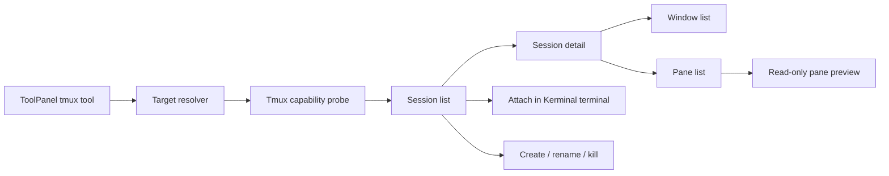

# tmux 右栏管理能力生产级方案

## 目标

- 在 Kerminal 右侧工具栏新增 `tmux` 管理能力，让用户围绕当前机器或当前终端 pane 管理 tmux server、session、window 和 pane。
- 借鉴截图中的轻量工作流：顶部展示 tmux 可用性和版本，提供刷新、新建、退出当前，下面用卡片列出会话、连接状态、cwd 和快捷动作。
- 与 Kerminal 现有终端工作台打通：选中会话后可在当前 tab 新开 pane 或新 tab attach；关闭 Kerminal pane 不杀 tmux session；tmux session 可跨 SSH 断线保活。
- 保持 Kerminal 的边界：Kerminal 管理运行态 tmux，不托管 `.tmux.conf`，不替代 tmux 自身布局能力，不绕过现有终端、SSH、Docker 和外部 Agent 安全边界。

## 非目标

- 不内置或打包 tmux；本机、远端或容器目标必须自行安装 tmux。
- 第一阶段不做 `.tmux.conf` 编辑器、插件管理、主题同步、keybinding 管理和 tmux resurrect/continuum 管理。
- 第一阶段不做跨主机 tmux server 聚合，也不把一个 tmux session 迁移到另一台机器。
- 第一阶段不恢复旧内置 AI provider、自定义 MCP CRUD、pending/confirm/approval/audit 链路。
- 不直接解析 tmux 默认人类可读输出；所有列表和详情都必须走 `-F` format 或 control mode。

## 产品学习结论

截图体现的是一个低噪声的 tmux sidebar：

- Header 只回答三个问题：当前能力是什么、tmux 是否可用、版本是多少。
- 主操作只有两个：新建 session、退出当前 attach。
- 会话列表用数字或名称做主标识，用状态 chip 表示 attached/unattached，用 cwd 帮用户识别工作上下文。
- 每条 session 只放高频动作：attach/open、rename、delete；其它低频 window/pane 动作进入详情层。

tmux 自身能力边界来自官方资料：

- tmux 的核心价值是让程序在一个终端内切换、detach 后后台保活，并可重新 attach。参考：https://github.com/tmux/tmux/wiki
- session/window/pane 可以通过 `list-sessions`、`list-windows`、`list-panes` 获取，且 `-F` 能输出稳定格式。参考：https://github.com/tmux/tmux/wiki/Advanced-Use
- format 是 tmux 自动化的基础，`-F` 可用于 list commands、display-message、new-session 等命令。参考：https://github.com/tmux/tmux/wiki/Formats
- control mode 允许外部客户端通过文本协议控制 tmux 并接收异步通知，适合作为后续实时 watcher。参考：https://github.com/tmux/tmux/wiki/Control-Mode

## 用户体验

### 入口

- 右侧工具栏新增 `tmux` tool，建议使用 `Layers` 或 `PanelTop` 类图标，和截图中的层叠语义一致。
- 默认上下文来自 `focusedPane`；如果当前 pane 绑定了 SSH/Docker/Local target，tmux tool 自动使用该 target。
- 没有 focused pane 时使用 `selectedMachine`；没有目标时显示空态，引导用户先选择机器或打开终端。
- tool header 显示：
  - 标题：`tmux`
  - 副标题：`tmux 3.x`、`未安装`、`目标不可用`、`检测失败`
  - 右侧：刷新按钮

### 主界面

- 顶部固定主操作区：
  - `新建`：创建 tmux session，默认名称为当前目录 basename 或 `kerminal-<timestamp>`。
  - `退出当前`：只对由 Kerminal attach 打开的 tmux pane 可用；默认关闭当前 attach client，保留 tmux session。
- Session card 字段：
  - 主标题：session name；如果 name 为空则显示 session id。
  - 状态 chip：`已连接`、`未连接`、`当前`、`失效`
  - cwd：来自 active pane 的 `pane_current_path`，超长中间省略。
  - 摘要：window 数、pane 数、client 数、最近 activity。
  - 动作：attach/open、rename、kill。
- 点击 card 进入详情：
  - Windows：window index/name/active flag/pane count/layout。
  - Panes：pane id/current command/current path/size/dead flag。
  - Preview：`capture-pane` 最近 N 行，只读预览，不写入 terminal。

### 状态与空态

- `checking`：加载 skeleton，禁用动作。
- `unavailable`：显示 tmux 未安装或目标不是 Unix-like shell；提供刷新，不提供安装命令自动执行。
- `empty`：tmux 可用但无 session；突出 `新建`。
- `stale`：上次列表中的 session 已不存在；card 保留一轮并显示失效，下一次刷新移除。
- `busy`：每个 session action 独立 busy，避免全栏锁死。
- `danger`：kill session/window/pane 统一使用现有 ModalShell/PromptDialog，不用浏览器原生 confirm。

## 信息架构



## 后端架构

### 模块边界

- `src-tauri/src/models/tmux.rs`
  - 只定义请求、响应和稳定错误语义。
- `src-tauri/src/services/tmux_service.rs`
  - 负责编排 probe/list/create/rename/kill/capture。
  - 不直接拼 shell string；通过 executor facade 运行目标侧命令。
- `src-tauri/src/services/tmux_service/parser.rs`
  - 解析 `tmux -F` 输出和 fixture。
  - 测试 fixture 放在 `src-tauri/tests/support` 或 `src-tauri/tests/tmux_service.rs`，不混入生产路径。
- `src-tauri/src/commands/tmux.rs`
  - 只做 Tauri command 参数校验和 service 调用。
- `src/lib/tmuxApi.ts`
  - 前端 typed invoke wrapper。
- `src/features/tool-panel/TmuxToolContent.tsx`
  - 右栏 UI 容器；复杂状态派生下沉到 model。
- `src/features/tool-panel/tmux/tmuxToolModel.ts`
  - view model、排序、状态 chip、按钮 enablement、错误文案。

### Target executor facade

tmux 命令必须跑在目标机器上，而不是一律跑在 Kerminal 本机：

| Target | 执行方式 | 第一阶段 |
| --- | --- | --- |
| Local Unix-like | 本地 process/pty 执行 `tmux` | 支持 |
| Local Windows | 仅当 PATH 中存在 `tmux.exe` 或运行在可用 Unix shell 环境时支持 | 探测后展示 |
| SSH | 复用现有 SSH command/terminal 能力，在远端执行 `tmux` | 支持 |
| Docker/Podman target | 复用容器 terminal command builder，在容器内执行 `tmux` | 第二阶段 |
| Serial/Telnet/RDP | 无可靠非交互命令通道 | 第一阶段不支持 |

建议引入窄接口：

```rust
pub trait TmuxCommandExecutor {
    fn run_tmux(&self, target: &TmuxTargetRef, args: &[String]) -> AppResult<TmuxCommandOutput>;
    fn open_tmux_terminal(
        &self,
        target: &TmuxTargetRef,
        args: &[String],
        title: &str,
    ) -> AppResult<TerminalSessionSummary>;
}
```

实现要求：

- 本地执行优先使用 argv，不经过 shell。
- SSH/容器执行如果必须经过 shell，必须使用统一 shell quoting helper；禁止在 service 中手写拼接。
- 所有用户可控 session/window/pane 名称只作为 argv 参数或经过 quoting helper。
- destructive 命令只接受 tmux id 或已验证 name；优先使用 `$session_id`、`@window_id`、`%pane_id`。

### tmux server scope

`TmuxTargetRef` 不只等于 Kerminal machine id，还要包含 tmux socket 范围：

```rust
pub struct TmuxTargetRef {
    pub target_ref: String,
    pub socket_name: Option<String>,
    pub socket_path: Option<String>,
    pub tmux_path: Option<String>,
}
```

规则：

- 默认 socket 使用 tmux 默认 server。
- 高级设置允许输入 socket name/path，但第一阶段只在当前右栏 runtime state 保存，不写长期配置。
- 任何 socket path 都必须在目标侧解释；本机不做跨平台路径展开。
- socket name/path 同时存在时拒绝，避免 `-L` 和 `-S` 语义混用。

### 命令契约

第一阶段 Tauri commands：

| Command | 用途 | 关键行为 |
| --- | --- | --- |
| `tmux_probe` | 检测可用性和版本 | 运行 `tmux -V`，返回 `available/version/reason` |
| `tmux_list_sessions` | 列出 session summary | 使用 `list-sessions -F`，不可用返回 typed error |
| `tmux_list_windows` | 列出指定 session windows | target 必须是 session id/name |
| `tmux_list_panes` | 列出指定 window/session panes | 优先按 window id |
| `tmux_create_session` | 新建 detached session | 默认 `new-session -d -s <name> -c <cwd>` |
| `tmux_attach_session` | 在 Kerminal 中 attach | 创建 terminal session 运行 `tmux attach-session -t <id>` |
| `tmux_rename_session` | 重命名 session | 成功后刷新 list |
| `tmux_kill_session` | kill session | 必须二次确认，后端仍只执行命令 |
| `tmux_capture_pane` | 获取只读预览 | `capture-pane -p -t <pane_id> -S -<lines>`，限制最大行数 |
| `tmux_detach_current` | 退出当前 Kerminal attach | 第一阶段关闭当前 attach terminal；后续可升级为 tmux client 精确 detach |

第二阶段再加：

- `tmux_new_window`
- `tmux_rename_window`
- `tmux_kill_window`
- `tmux_split_pane`
- `tmux_send_keys`
- `tmux_select_window`
- `tmux_select_pane`

`send_keys`、`split_pane` 和批量操作风险更高，必须单独做权限/确认和真实远端 smoke。

### 输出格式

- 禁止解析 `tmux ls` 默认输出。
- 使用 `list-sessions/list-windows/list-panes -F` 输出稳定字段。
- 字段中包含用户可控文本时使用 tmux `q` format modifier 或内部 escaping 策略，并用 fixture 覆盖空格、引号、中文、控制字符和很长名称。
- parser 只接收当前 command 指定的字段数量；字段不匹配时返回 `TmuxParseError`，不 silently fallback。

建议 session format 字段：

```text
#{session_id}
#{q:session_name}
#{session_attached}
#{session_windows}
#{session_created}
#{session_activity}
#{q:session_path}
#{window_id}
#{pane_id}
#{q:pane_current_path}
```

### 数据模型

```ts
export interface TmuxCapabilityStatus {
  targetRef: string;
  available: boolean;
  version?: string;
  reason?: string;
  socketName?: string;
  socketPath?: string;
}

export interface TmuxSessionSummary {
  id: string;
  name: string;
  attached: boolean;
  windows: number;
  clients: number;
  activeWindowId?: string;
  activePaneId?: string;
  currentPath?: string;
  createdAt?: number;
  activityAt?: number;
  targetRef: string;
  status: "running" | "stale";
}

export interface TmuxWindowSummary {
  id: string;
  sessionId: string;
  index: number;
  name: string;
  active: boolean;
  panes: number;
  layout?: string;
  flags?: string;
}

export interface TmuxPaneSummary {
  id: string;
  windowId: string;
  index: number;
  active: boolean;
  currentPath?: string;
  currentCommand?: string;
  title?: string;
  width: number;
  height: number;
  dead: boolean;
}
```

## 前端架构

### ToolPanel 接入

- 在 `ToolId` 增加 `tmux`。
- 在 `workspaceData.tools` 增加 `tmux` summary。
- 在 `ToolPanel.tsx` 增加 lazy import `TmuxToolContent`，传入：
  - `activeTab`
  - `focusedPane`
  - `selectedMachine`
  - `terminalTabs`
  - `onCreateTerminal`
  - `onSplitPane`
- 右栏样式复用 `bg-[var(--surface-terminal)]`、`border-[var(--border-subtle)]`、`text-[var(--text-primary)]` 等主题变量；不要硬编码只适配深色的色彩。

### 状态派生

`tmuxToolModel.ts` 负责：

- target 解析优先级：focused pane target > active tab machine > selected machine。
- session card 排序：current attached > attached > recent activity > name。
- action enablement：unavailable/unsupported/busy/stale/destructive。
- empty/error/loading 文案。
- session name 默认值。

React component 只负责渲染和调用 action，不承载复杂判断。

### Attach 语义

Attach 不复用当前 xterm 内容，也不把 tmux pane 渲染成自定义 UI；第一阶段直接打开 Kerminal terminal：

- `Attach in new pane`：在当前 tab split 一个 pane，运行目标侧 `tmux attach-session -t <session_id>`。
- `Attach in new tab`：打开新 terminal tab，运行同样命令。
- 如果当前 session 已有 Kerminal attach pane，点击 attach 只 focus 已有 pane，不重复打开。
- Kerminal 记录 `TerminalPane.tmuxBinding`：

```ts
interface TmuxPaneBinding {
  targetRef: string;
  sessionId: string;
  sessionName: string;
  socketName?: string;
  socketPath?: string;
  attachedAt: string;
}
```

该 binding 只用于 UI 状态和 focus，不作为 tmux 事实源；事实源仍是目标侧 tmux server。

## 安全与权限

- kill session/window/pane 必须走确认弹窗，弹窗明确展示 target、session/window/pane 名称和 id。
- 不新增 MCP 配置 CRUD；如果后续给外部 Agent 暴露 tmux tool，只能暴露运行态能力，并遵守 Kerminal MCP tools-only 边界。
- 不在日志或文档中记录远端完整命令输出中的凭据；capture preview 做长度限制和脱敏复用现有 redaction。
- 对 session/window/pane name 做长度限制和控制字符拒绝；展示层对超长文本 truncate。
- 对 socket path/name 做字符和长度校验，避免 shell 注入和路径混淆。
- attach terminal 的启动命令必须可审计，错误中不泄露 SSH 密码、私钥、token 或代理地址。

## 性能

- 默认只列 session；window/pane 详情按需加载。
- Refresh 使用 per-target request coalescing，快速连点只保留最后一次。
- capture-pane 默认最多 200 行，UI 预览最多渲染 100 行，可手动展开。
- 不启动全局 tmux watcher；第一阶段仅用户打开右栏时 probe/list。
- 第二阶段如引入 control mode watcher，必须：
  - 每个 target/socket 最多一个 watcher。
  - 后台空闲自动停止。
  - 断线指数退避。
  - 事件进入轻量 store，不直接驱动大量 React setState。

## 错误模型

| 错误 | UI 表现 | 后端语义 |
| --- | --- | --- |
| `TmuxUnavailable` | 未安装/不可用空态 | `tmux -V` 失败或 not found |
| `UnsupportedTarget` | 当前目标不支持 tmux | serial/telnet/rdp 或无非交互 executor |
| `TargetDisconnected` | 目标断开，提供刷新 | SSH/container command 失败 |
| `SessionNotFound` | card 标记 stale | action target 已不存在 |
| `ParseError` | 检测失败，提示刷新/上报 | format 输出字段不匹配 |
| `ActionRejected` | 保持原状态，展示原因 | 参数校验拒绝 |

错误文案要区分“目标不可用”和“tmux 未安装”，避免用户误判。

## 测试策略

### Rust

- `tmux_service` parser fixture：
  - 空列表。
  - 普通 session。
  - session/window/pane 名称带空格、中文、引号。
  - dead pane、无 cwd、attached/unattached。
  - 字段数量错误和非法 id。
- executor fake：
  - probe success/fail。
  - list/create/rename/kill command argv。
  - SSH executor shell quoting。
  - stale session after kill。
- command tests：
  - 参数校验。
  - destructive command 不接受空 id。
  - socket name/path 冲突拒绝。

### 前端

- `tmuxToolModel.test.ts`：
  - target resolver。
  - card 排序。
  - action enablement。
  - empty/error/loading view model。
- `TmuxToolContent.test.tsx`：
  - probe/list 成功。
  - tmux unavailable。
  - 新建 session 表单。
  - rename/kill dialog。
  - attach focus existing pane。
- `ToolPanel.test.tsx`：
  - tool rail 新入口。
  - lazy content 渲染 fallback。
- 主题验证：
  - 深色、浅色、跟随系统截图。
  - 窄宽度右栏布局。

### 真实启动和 smoke

- `npm run build`
- dev server HTTP smoke。
- 涉及 Rust command 后运行相关 `cargo test`。
- 真实 `npm run tauri:dev`：
  - 本机无 tmux：显示 unavailable。
  - WSL/Linux/SSH 有 tmux：probe/list/create/attach/kill smoke。
  - SSH 断线后：UI 显示 target disconnected。

## 实施切片

- [x] TASK-001 tmux 模型和 parser
  - 新增 Rust/TS 类型、format parser、fixture。
  - 不接 UI，不执行真实命令。
  - 验证：parser/model tests。

- [x] TASK-002 Target executor 和 Tauri commands
  - 接入 Local + SSH command executor。
  - 实现 probe/list/create/rename/kill/capture。
  - 验证：executor fake tests、command tests、Rust fmt。

- [x] TASK-003 前端 API 和 view model
  - 新增 `src/lib/tmuxApi.ts` 和 `tmuxToolModel.ts`。
  - 覆盖 target resolver、排序、状态、action enablement。
  - 验证：Vitest 相邻测试。

- [x] TASK-004 右栏 tmux 基础 UI
  - ToolPanel 接入新 tool。
  - 实现 header、refresh、新建、session cards、empty/unavailable/error。
  - 验证：ToolPanel/TmuxToolContent tests、三主题截图、dev server smoke。

- [x] TASK-005 attach/detach 当前
  - attach 在新 pane/new tab 打开 Kerminal terminal。
  - 已有 Kerminal attach pane 时 focus existing。
  - `退出当前` 第一阶段关闭当前 attach pane，保留 tmux session。
  - 验证：workspace state tests、真实 tmux smoke。

- [x] TASK-006 window/pane 详情和 preview
  - 按需 list windows/panes。
  - `capture-pane` 只读预览，限制行数。
  - 验证：UI tests、性能 smoke。

- [x] TASK-007 Docker target 和 control mode 评估
  - 评估容器 executor 复用成本。
  - 评估是否需要 control mode watcher。
  - 只输出报告或 ADR，不直接扩大第一阶段实现。

## TASK-007 评估结论

- Docker/Podman target 暂不进入第一阶段：现有容器终端路径以交互式 `docker exec` 为主，tmux 管理需要稳定的非交互 command executor、shell quoting 和容器内 cwd 语义；直接复用当前终端启动链路会把 UI 管理动作和交互终端耦合，后续应单独做容器 executor adapter。
- control mode 暂不进入第一阶段：右栏基础管理已能通过 probe/list/detail/capture/attach 覆盖核心路径；control mode 会引入常驻进程、异步事件、断线重连、资源释放和每 target/socket watcher 配额，适合作为第二阶段实时 watcher lane。
- 当前第一阶段边界保持 Local + SSH：不托管 `.tmux.conf`，不解析人类可读输出，不用关闭 Kerminal attach pane 杀 tmux session，不恢复旧 MCP CRUD 或审批链路。

## 回滚策略

- 前端入口可通过从 `workspaceData.tools` 移除 `tmux` 立即隐藏。
- Tauri commands 独立注册，回滚不影响 terminal/SSH/SFTP/Agent Launcher 现有链路。
- 不写长期 tmux 配置，回滚无需迁移用户数据。
- 如果 attach binding 进入 workspace session，必须带版本字段；回滚时忽略未知 `tmuxBinding` 字段。

## 验收标准

- 在有 tmux 的 SSH/Linux 目标上，用户能刷新看到 session，创建 session，attach 到新 pane，rename，kill，并看到状态及时更新。
- 在无 tmux 或不支持目标上，UI 明确说明原因且不出现白屏或未捕获异常。
- 关闭 Kerminal attach pane 不杀 tmux session；重新 attach 能回到原 session。
- 深色、浅色、跟随系统主题均可读，窄右栏文本不溢出。
- 自动化测试覆盖 parser、executor facade、Tauri command 校验、前端 view model 和关键 UI action。
- `npm run build`、dev server smoke 和必要 `npm run tauri:dev` 通过，无法覆盖的远端场景写入 blocker 或 Round Log。

## 风险

- tmux 只存在于 Unix-like 环境，Windows local 支持不可假设；必须 probe 后展示。
- SSH executor 若用 shell string，quoting 是最大风险；必须集中到 helper 并测试。
- tmux format 字段中存在用户文本，parser 不能 silently 接受损坏字段。
- `detach current` 很难精确定位 tmux client；第一阶段以 Kerminal attach binding 控制当前 pane，避免误 detach 其它客户端。
- control mode 能提供实时事件，但会引入后台进程、重连和资源释放复杂度，不能和第一阶段基础管理混在一个切片。

## Round Log

- 2026-06-25T11:46:27+08:00：根据用户提供的右栏 tmux 截图、Kerminal 当前 ToolPanel/TerminalManager/Agent Launcher/Port Forwarding 架构和 tmux 官方 wiki 资料，完成生产级方案设计。本轮只写计划文档，不修改生产代码；后续实现建议从 TASK-001 开始。
- 2026-06-25T11:54:37+08:00：用户要求采用不限制数量的并行策略执行本计划。计划已从 `next/` 移入 `active/`；本轮并行启动 Rust/Tauri 接入、前端 ToolPanel 接入和终端 attach 路径勘察 agent，同时主线开始做 tmux 模型、parser、commands、右栏 UI 和验证闭环。
- 2026-06-25T12:52:59+08:00：完成第一阶段实现并收口。实际修改覆盖 Rust tmux model/service/parser/commands、SSH remote command 启动支持、前端 `tmuxApi`、右栏 `TmuxToolContent`、ToolPanel/KerminalShell 接入、workspace attach/focus binding、session 恢复和相邻测试；`workspaceStore.ts` 的 tmux attach 状态编排已抽到 `workspaceTmuxState.ts`，文件降到 952 行。验证通过：`npm run typecheck`；`npm run test:frontend -- src/lib/tmuxApi.test.ts src/features/tool-panel/tmux/tmuxToolModel.test.ts src/features/tool-panel/TmuxToolContent.test.tsx src/features/workspace/workspaceStore.terminalOpen.test.ts src/features/workspace/workspaceSession.test.ts src/features/tool-panel/ToolPanel.test.tsx`（6 files / 47 tests）；`cd src-tauri && cargo fmt --check`；`cd src-tauri && cargo test --test tmux_service`（5 tests）；`npm run build`；dev server `http://127.0.0.1:5173/` smoke；Tauri dev smoke 通过 `npx tauri dev --no-watch --config '{"build":{"beforeDevCommand":"","devUrl":"http://localhost:1425"}}'`，复用已有 1425 dev server，编译完成并启动 `target\debug\kerminal.exe`，10 秒内无崩溃后手动停止。UI 证据：`.updeng/docs/verification/tmux-sidebar-dark-20260625.png`、`.updeng/docs/verification/tmux-sidebar-light-settings-20260625.png`、`.updeng/docs/verification/tmux-sidebar-system-dark-settings-20260625.png`。额外检查：`npm run check:source-size` 当前因既有非本轮大文件失败，tmux 本轮抽取后的 `workspaceStore.ts` 和新增文件未超过 1000 行；`git diff --check` 针对 tmux 相关文件通过。未提交原因：当前工作区存在大量未归因并行改动，本轮只记录验证与计划收口，不做 staging/commit。
- 2026-06-25T13:02:00+08:00：目标完成审计复跑当前工作树。状态证据：本计划位于 `plan/done/` 且 frontmatter 为 `status: done`，`plan/INDEX.md` Active 表为空，`in-progress.md` 显示暂无 active，`coordination/lanes.json` 中 `lane-tmux-sidebar-management-implementation` 为 done，`coordination/status.md` 无 active lane/shared conflict。当前验证复跑通过：`npm run typecheck`；`npm run test:frontend -- src/lib/tmuxApi.test.ts src/features/tool-panel/tmux/tmuxToolModel.test.ts src/features/tool-panel/TmuxToolContent.test.tsx src/features/workspace/workspaceStore.terminalOpen.test.ts src/features/workspace/workspaceSession.test.ts src/features/tool-panel/ToolPanel.test.tsx`（6 files / 47 tests）；`cd src-tauri && cargo fmt --check`；`cd src-tauri && cargo test --test tmux_service`（5 tests）；`npm run build`；`Invoke-WebRequest http://localhost:1425/` 返回 200；`npx tauri dev --no-watch --config '{"build":{"beforeDevCommand":"","devUrl":"http://localhost:1425"}}'` 编译完成并启动 `target\debug\kerminal.exe`，10 秒无崩溃后手动停止。当前仍有 `npm run check:source-size` 的既有大文件失败，失败列表不包含本轮 tmux 文件；tmux 相关行数复核：`workspaceStore.ts` 952、`workspaceTmuxState.ts` 218、`TmuxToolContent.tsx` 851、`ToolPanel.test.tsx` 978。
