# Kerminal 文件型配置运行时自动刷新生产级方案

## 目标

- 外部 Agent、人工编辑器或脚本修改 `~/.kerminal` 文件型配置后，运行中的 Kerminal 界面能自动、稳定、可诊断地反映变化。
- 配置刷新成功后，前端显示一条简洁、geek 风格、自动关闭的提示，说明应用里新增或变更了什么配置。
- 覆盖完整配置域：`settings.toml`、`profiles/*.toml`、`hosts/groups.toml`、`hosts/*.toml`、`secrets/hosts/*.toml`、`snippets/*.toml`、`workflows/*.toml`。
- 配置坏掉时保留当前 last-known-good UI，不白屏、不清空主机树、不关闭现有终端。
- 方案与 ADR-0016/0017/0019 保持一致：配置仍由文件编辑和 validator 承担，MCP 不重新增加 CRUD；Kerminal 只提供运行态反馈和刷新。
- 形成可逐步实施、可测试、可回滚的生产级基础设施，不采用“刷新按钮”或只覆盖 host 的 MVP。

## 非目标

- 不重新引入 settings/profile/host/snippet/workflow 的 MCP CRUD。
- 不修改真实用户 `~/.kerminal` 配置或凭据。
- 不把 `secrets/hosts/*.toml` 的文件名、密码、内联私钥或 token 发到前端事件。
- 不在 toast/notice 里展示 secret 路径、用户名、密码、私钥、token、原始 TOML 值或本地绝对路径。
- 不让 watcher 承担配置修复、自动合并冲突或 AI 审批。
- 不改变 `ConfigFileStore` 作为事实源的地位。

## 现状与问题

- 当前前端 `KerminalShell` 启动时会调用 `refreshRemoteHostTree()`，应用内新增/编辑/删除主机后也会刷新。
- 后端 `remote_host_tree` 每次通过 `ConfigFileStore` 从磁盘读取 groups、hosts 和 secrets。
- 缺口是：外部 Agent 直接写 TOML 后，运行中的前端没有配置文件事件入口，因此不会自动调用刷新。
- `FileStore` 已经做原子写：写 `.xxx.tmp-<pid>-<uuid>`，再 rename 到目标；Windows 下替换既有文件会 remove + rename。这要求 watcher 必须处理多事件、rename 和短暂文件缺失。

## 外部调研结论

| 实践来源 | 关键做法 | 本方案采用方式 |
| --- | --- | --- |
| Rust `notify` / `notify-debouncer-full` | 跨平台 watcher 不能假设事件形态一致；需要 debouncer 和 fallback。 | Rust 默认 native watcher，事件进入 domain coalescer；native 不可用时 fallback polling。 |
| Chokidar | 生产 watcher 需要处理 atomic save 和写入稳定窗口。 | 设置 debounce + retry + max wait；reload 前用 typed reader 验证文件已稳定。 |
| VS Code File Watcher Internals | watcher 是可诊断基础设施，按请求限定范围，避免过宽监听，并支持 watcher restart。 | 只 watch 配置相关目录；排除 agent sessions、backups、tmp；新增 watcher status 诊断。 |
| Tauri events | 事件适合通知，事实数据应由前端再调用命令读取。 | 事件 payload 只带 domain/sequence/status，前端按域调用现有 API 拉取事实。 |

资料入口：

- <https://docs.rs/notify>
- <https://docs.rs/notify-debouncer-full>
- <https://github.com/paulmillr/chokidar#readme>
- <https://github.com/microsoft/vscode/wiki/File-Watcher-Internals>
- <https://v2.tauri.app/develop/calling-frontend/>

## 架构决策

长期决策记录在 [ADR-0020](../../decisions/ADR-0020-config-change-observer.md)。

采用“Rust 配置变更观察者 + 域级失效通知 + 前端刷新协调器”：

```mermaid
flowchart LR
  A["External agent / editor writes TOML"] --> B["ConfigChangeObserverService"]
  B --> C["Path classifier"]
  C --> D["Debounce + dedupe + retry"]
  D --> E["Typed validation via ConfigFileStore"]
  E --> F["Tauri event: kerminal-config-changed"]
  F --> G["Frontend configRefreshCoordinator"]
  G --> H["Existing typed APIs"]
  H --> I["Workspace/settings/tools state"]
```



核心原则：

- watcher 只做失效通知，不发送完整配置。
- 前端收到事件后仍调用 `listRemoteHostTree()`、`listProfiles()`、settings reader、`listSnippets()`、`listWorkflows()` 读取事实源。
- Rust 事件只发送 domain，不发送 secret 文件路径；`secrets/hosts/*.toml` 统一归入 `hosts`。
- 坏配置只产生 invalid 状态和诊断，不覆盖 UI 的 last-known-good。
- 事件顺序使用单调 `sequence`，前端忽略旧事件和过期 reload 结果。
- 用户可见提示由前端刷新成功后基于 old/new public state 生成，而不是信任原始 watcher 路径或事件细节。

## 目标模块设计

### Rust: `ConfigChangeObserverService`

建议新增：

- `src-tauri/src/models/config_change.rs`
- `src-tauri/src/services/config_change_observer_service.rs`
- `src-tauri/tests/config_change_observer_service.rs`

核心类型：

```rust
pub enum ConfigDomain {
    Settings,
    Profiles,
    Hosts,
    Snippets,
    Workflows,
}

pub enum ConfigWatchStatus {
    Ready,
    Invalid,
    WatcherUnavailable,
}

pub struct ConfigChangeBatch {
    pub version: u32,
    pub sequence: u64,
    pub batch_id: String,
    pub observed_at: String,
    pub domains: Vec<ConfigDomain>,
    pub status: ConfigWatchStatus,
    pub diagnostics: Vec<ConfigChangeDiagnostic>,
    pub source_hint: ConfigChangeSourceHint,
}
```

职责：

- 初始化 watch scope：
  - root: 观察 `settings.toml` 和配置目录创建/删除；
  - `profiles/`
  - `hosts/`
  - `secrets/hosts/`
  - `snippets/`
  - `workflows/`
- 忽略：
  - `.storage.lock`
  - `storage-manifest.toml`
  - `backups/**`
  - `agents/**`
  - `workspace/**`
  - `data/**`
  - `*.log`
  - `.tmp-*` 和 `.*.tmp-*`
- 路径分类：
  - `settings.toml` -> `settings`
  - `profiles/*.toml` -> `profiles`
  - `hosts/groups.toml`、`hosts/*.toml`、`secrets/hosts/*.toml` -> `hosts`
  - `snippets/*.toml` -> `snippets`
  - `workflows/*.toml` -> `workflows`
- 去抖策略：
  - `quiet_window`: 500-800ms 起步；
  - `max_batch_wait`: 2500ms；
  - reload 失败如果是 NotFound/TOML parse，短重试 3-5 次；
  - 最终仍失败才发 invalid。
- 后端验证：
  - `settings` -> `read_settings_or_default()`
  - `profiles` -> `list_profiles()`
  - `hosts` -> `list_remote_host_tree()`
  - `snippets` -> `list_snippets()`
  - `workflows` -> `list_workflows()`
- 事件发送：
  - `app.emit("kerminal-config-changed", payload)`
  - payload 不带文件内容；secret path 只记录 `hosts` domain。
- watcher backend：
  - 默认 `notify::RecommendedWatcher` / debouncer；
  - native watcher 初始化失败或连续错误超过阈值时 fallback `PollWatcher`；
  - watcher 根目录被删除/重建时进入 rebind loop。

### Rust: 诊断入口

新增只读 command 或接入 diagnostics panel：

```text
config_watch_status
```

返回：

- `enabled`
- `backend: native | polling | unavailable`
- `watchedRoots`
- `ignoredGlobs`
- `lastSequence`
- `lastBatchAt`
- `lastDomains`
- `lastStatus`
- `lastError`
- `fallbackReason`

诊断入口只读，不暴露 secret 内容。

### 前端: `configRefreshCoordinator`

建议新增：

- `src/app/useKerminalConfigEvents.ts`
- `src/app/configRefreshCoordinator.ts`
- `src/app/configRefreshCoordinator.test.ts`

事件类型：

```ts
type ConfigDomain = "settings" | "profiles" | "hosts" | "snippets" | "workflows";

type ConfigChangeEvent = {
  version: 1;
  sequence: number;
  batchId: string;
  observedAt: string;
  domains: ConfigDomain[];
  status: "ready" | "invalid" | "watcher-unavailable";
  diagnostics: Array<{
    domain?: ConfigDomain;
    message: string;
    path?: string;
  }>;
  sourceHint: "kerminal" | "external" | "unknown";
};
```

Notice 类型：

```ts
type ConfigChangeNotice = {
  id: string;
  batchId: string;
  level: "info" | "warning" | "error";
  text: string;
  ttlMs: number;
  domains: ConfigDomain[];
};
```

刷新策略：

- 全局只订阅一次 Tauri event，挂在 `KerminalShell`。
- coordinator 内部维护：
  - `lastSequence`
  - per-domain `refreshInFlight`
  - per-domain `revision`
  - invalid diagnostics
  - before/after public snapshots for notice summary
- 事件处理：
  - status `ready`：按 domain 调用 reload；
  - status `invalid`：显示提示，保留 last-known-good；
  - status `watcher-unavailable`：显示诊断入口，不影响现有操作。
- stale result 保护：
  - 每次 reload 分配 token；
  - reload 结束时如果 token 已过期，不写 store。
- notice 生成：
  - 只对 `sourceHint: external | unknown` 的成功 reload 默认显示；应用内保存可静默或显示现有保存反馈，避免双提示。
  - hosts/profiles/snippets/workflows 用 reload 前后的公开列表做 diff；单个新增显示名称，多个变化显示数量。
  - settings 只显示 section 级摘要，不显示具体值。
  - secret-only 变化只显示 credentials 级摘要，不显示 secret 文件名或内容。
  - 同一 batch 多域合并为一条 notice；短时间重复事件按 batch/sequence 去重。

各 domain 行为：

| Domain | 刷新动作 | 脏状态保护 |
| --- | --- | --- |
| `hosts` | 调用现有 `refreshRemoteHostTree()`，同步左侧主机树、SFTP host 选择、右栏 default host。 | 连接编辑弹框打开时不覆盖表单；保存前如果目标 host `updatedAt` 已变化，提示重新载入或确认覆盖。 |
| `profiles` | 调用 `listProfiles()` + `setProfiles()`；复用 profile-backed local sidebar 同步。 | 本地终端编辑弹框打开时不覆盖表单。 |
| `settings` | 调用 settings reader + `setSettings()`，更新主题/密度/终端外观。 | 设置弹框 dirty 或 saving 时只提示“外部设置已变化”，不覆盖当前表单。 |
| `snippets` | 递增 snippets revision；SnippetToolContent 打开时或已打开时重新 `loadSnippets()`。 | 创建/编辑片段弹框打开时保留 draft。 |
| `workflows` | 递增 workflows revision；WorkflowToolContent 打开时或已打开时重新 `loadWorkflows()`。 | 正在编辑/运行 workflow 时保留 run state，仅刷新列表。 |

### UI 呈现

- 使用现有 shell notice / toast 风格，主题必须覆盖 light/dark/system。
- 正常 external/unknown 刷新也显示一条轻量 notice，让用户知道 AI/外部编辑已经进入应用状态。
- notice 默认 2600-3500ms 自动关闭；invalid/watcher unavailable 也自动关闭，但 diagnostics/status 保留可追踪状态。
- 文案保持 geek、短促、信息密度高：
  - `cfg: +1 host "staging-api"`
  - `cfg: hosts +2, snippets +1`
  - `cfg: settings reloaded`
  - `cfg: host credentials updated`
  - `cfg: invalid TOML, kept last-known-good`
- UI 约束：
  - 不遮挡终端输入光标、侧栏菜单和弹窗主要操作；
  - `aria-live="polite"`，不抢焦点；
  - 宽度有限制，长名称中间截断；
  - 复用主题变量或成对 `dark:` 样式，不新增单主题硬编码色；
  - portal 必须继承全局主题。

## 执行步骤

- [x] TASK-001: 写入 ADR 和生产级实施计划。
  - 本文档和 ADR-0020 完成后，该任务视为完成。
  - 验证：文档路径存在，plan INDEX 已登记。

- [x] TASK-002: 后端事件模型与路径分类器。
  - 新增 `ConfigDomain`、`ConfigChangeBatch`、diagnostic/status/source hint。
  - 新增 path classifier，覆盖所有配置文件、忽略项和 secret redaction。
  - 测试：classifier unit tests 覆盖 Windows/Unix 分隔符、临时文件、backup、secret。

- [x] TASK-003: 后端 watcher adapter 与 coalescer。
  - 引入 `notify`、`notify-debouncer-full`。
  - 设计 `ConfigWatcherAdapter` trait，生产实现接 native/polling watcher，测试实现用 fake event stream。
  - 实现 debounce、dedupe、retry、sequence、batch id。
  - 测试：create/remove/rename/modify 风暴只产出一次 domain batch；半写入先重试。

- [x] TASK-004: 后端 typed validation 和 Tauri lifecycle。
  - `ConfigChangeObserverService` 在 app setup 后启动，持有 `AppHandle` 发事件。
  - reload 前调用 `ConfigFileStore` typed reader 做域级验证。
  - `AppState` 暴露 watcher status。
  - watcher drop/窗口关闭时释放资源。
  - 测试：temp root + fake watcher；必要时加 native watcher smoke。

- [x] TASK-005: 诊断 command / diagnostics panel 接入。
  - 新增 `config_watch_status` 或并入现有 diagnostics command。
  - 返回 backend、watched roots、last sequence、last error、fallback。
  - 测试：command 返回不包含 secret 文件名或内容。

- [x] TASK-006: 前端配置事件订阅、刷新协调器和 notice summary model。
  - 新增 `useKerminalConfigEvents`，只在 `KerminalShell` 订阅一次。
  - 抽出 `configRefreshCoordinator` 处理 sequence、domain、stale result、invalid。
  - 抽出 `configChangeNoticeModel` 或同等纯模型，基于 reload 前后 public state 生成 safe notice。
  - hosts/profiles/settings 先接入；snippets/workflows 通过 revision 接入工具面板。
  - 测试：mock Tauri listen，断言 ready/invalid/unavailable 行为；notice 文案覆盖新增、删除、更新、批量、多域、secret redaction。

- [x] TASK-007: 脏表单和 last-known-good 保护。
  - RemoteHostCreateDialog、RemoteHostGroupCreateDialog、SettingsDialog、Snippet/Workflow create/edit 流程接入外部变更提示。
  - 保存前处理 `updatedAt` 或对象缺失冲突。
  - 测试：编辑表单打开时事件不覆盖 draft；确认 reload 后更新。

- [x] TASK-008: UI 反馈、geek notice、主题和可访问性。
  - 使用现有 notice/toast 体系展示成功刷新、invalid/watcher unavailable/dirty conflict。
  - 成功刷新提示必须说明新增/变更摘要，并自动关闭。
  - invalid/watcher unavailable 提示自动关闭，同时 diagnostics/status 保留可追踪状态。
  - 检查 light/dark/system 文案、对比度和焦点。
  - 验证：真实 dev server 三主题截图；如 UI 变动明显，补 Playwright/CDP smoke。
  - 当前进展：shell notice、自动关闭、`aria-live`、light/dark 样式和 close action 已接入；已通过真实 dev server 的 light/dark/system 截图检查。

- [x] TASK-009: 外部 Agent 配置文档同步。
  - 实现完成后更新 `.updeng/docs/config/kerminal-config-files.md` 和生成的 `kerminal-config.md` 说明：
    - 修改配置后 Kerminal 会自动刷新；
    - 坏 TOML 会保留 last-known-good；
    - Agent 仍必须运行 `kerminal.config.validate` 或手册 validator；
    - secrets 不会暴露到 UI 事件。
  - 注意：该路径当前由 `lane-external-agent-prompt-config-redesign` / `lane-agent-launch-pwsh` 共享，实施前必须同步对应 lane。

- [x] TASK-010: 端到端验证和启动门禁。
  - 外部写入 host/group/profile/snippet/workflow/settings，确认 UI 自动更新。
  - 写入坏 TOML，确认 UI 不清空并提示；修复后自动恢复。
  - 真实 `npm run tauri:dev` smoke。
  - `npm run build`、Rust targeted tests、必要前端 tests。
  - 当前结果：已用 `KERMINAL_CONFIG_ROOT` 隔离配置根和临时 app identifier 启动独立 Tauri/WebView2 实例，不写真实 `~/.kerminal`、不停止用户现有默认实例。外部 raw file writes 覆盖 settings/profile/host group/host/snippet/workflow ready notice，坏 host TOML invalid notice 和 last-known-good，修复后 recovery notice；真实 `config_watch_status` 返回 native backend、enabled、lastSequence=3、lastStatus=ready。

## 验证计划

### Rust

- `cargo fmt --manifest-path src-tauri/Cargo.toml --check`
- `cargo test --manifest-path src-tauri/Cargo.toml config_change_observer_service config_file_store`
- 如默认 target 被运行中 app 占用，使用隔离 target：
  - `cargo test --manifest-path src-tauri/Cargo.toml --target-dir src-tauri/target-codex-config-watch config_change_observer_service config_file_store -j 1`

### Frontend

- `npm run test -- --run src/app/configRefreshCoordinator.test.ts src/app/KerminalShell.test.tsx`
- `npm run test -- --run src/app/configChangeNoticeModel.test.ts`
- snippets/workflows/settings 接入后补对应 tool tests。
- `npm run typecheck`
- `npm run build`

### Runtime smoke

- 启动 `npm run tauri:dev`。
- 在外部编辑 `~/.kerminal/hosts/groups.toml` 和新增 `~/.kerminal/hosts/<id>.toml`，左侧主机树应在 debounce 窗口后出现新主机。
- 同一次外部新增 host 后，应显示类似 `cfg: +1 host "staging-api"` 的自动关闭 notice。
- 删除 host TOML，左侧主机树应移除对应主机，但已有终端 tab 不被关闭。
- 写入坏 `hosts/<id>.toml`，UI 提示 invalid，当前列表保持 last-known-good。
- 修复 TOML，UI 自动恢复。
- 编辑 `settings.toml` 主题/密度，主窗口自动应用；设置弹框有未保存修改时只提示不覆盖。
- 新增 snippet/workflow，打开右栏工具可见。

### UI 主题

- 如新增 notice/banner/dialog，必须覆盖：
  - light
  - dark
  - follow system
- 截图放 `.updeng/docs/verification/`，计划 Round Log 记录路径。

## 风险与缓解

| 风险 | 缓解 |
| --- | --- |
| 编辑器 atomic save 产生多次 rename/remove/create | 后端 debounce + retry + domain 合并，前端只按 sequence 接受最新结果。 |
| AI 分多步写 groups、host、secret，短时间内关系不完整 | quiet window + parse retry；最终无效才提示 invalid，last-known-good 不被清空。 |
| Windows rename 替换会先删除目标 | reload 重试处理 NotFound；删除事件不立即清空 UI。 |
| 网络盘/WSL/容器挂载 native watcher 不可靠 | native 初始化或连续错误后 fallback polling；诊断显示 backend。 |
| secrets 路径泄露 | backend 分类时只发 `hosts` domain，不发 secret path；诊断也脱敏。 |
| notice 泄露敏感信息 | notice 只从前端 public state diff 生成；secret/settings 只显示域级摘要；单测覆盖 redaction。 |
| 高频保存产生 toast 风暴 | 按 batch/sequence 去重，多域合并，短窗口内折叠为一条 notice。 |
| 应用内保存和 watcher 重复刷新 | source hint + sequence + frontend stale result guard；重复刷新必须幂等。 |
| 用户正在编辑表单被外部刷新覆盖 | per-dialog dirty guard；显示提示，不自动覆盖 draft。 |
| watcher 失效导致用户以为自动刷新生效 | watcher status command + UI warning；保留启动/保存手动刷新路径。 |
| 新依赖增大包体或跨平台行为不稳 | 依赖集中在 Rust service；保留 polling fallback 和可禁用开关。 |

## 回滚

- 关闭 watcher 启动和前端事件订阅，保留现有启动/应用内保存刷新。
- 保留新增 typed API 和前端 refresh helpers，不影响旧行为。
- 若新增依赖导致构建问题，移除 `notify` / `notify-debouncer-full`，把计划降级为 polling prototype 重新评估。
- 配置文件本身不迁移、不改 schema；回滚无需数据迁移。

## 并行协作边界

- 预计 owned paths：
  - `.updeng/docs/plan/active/PLAN-20260625-234914-config-change-observer.md`
  - `.updeng/docs/decisions/ADR-0020-config-change-observer.md`
  - `src-tauri/src/models/config_change.rs`
  - `src-tauri/src/services/config_change_observer_service.rs`
  - `src-tauri/tests/config_change_observer_service.rs`
  - `src/app/useKerminalConfigEvents.ts`
  - `src/app/configRefreshCoordinator.ts`
  - `src/app/configRefreshCoordinator.test.ts`
- 预计 shared paths：
  - `src-tauri/Cargo.toml`
  - `src-tauri/Cargo.lock`
  - `src-tauri/src/state.rs`
  - `src-tauri/src/lib.rs`
  - `src-tauri/src/services/mod.rs`
  - `src-tauri/src/commands/registry.rs` 或 diagnostics command 入口
  - `src/app/KerminalShell.tsx`
  - `src/app/useKerminalShellRemoteActions.ts`
  - snippets/workflows/settings 工具文件
  - `.updeng/docs/config/kerminal-config-files.md`
  - `.updeng/docs/config/external-agent-workspace.md`
- 当前 active lane 正在修改外部 Agent 配置文档和 `config_file_store.rs`，实施前必须读取：
  - `.updeng/docs/coordination/status.md`
  - `lane-external-agent-prompt-config-redesign`
  - `lane-agent-launch-pwsh`
  - 最新 diff 和 checkpoint

## 验收标准

- 外部新增 host 后，不重启 Kerminal，左侧主机树自动出现新主机。
- 外部新增 host 后出现简洁自动关闭提示，例如 `cfg: +1 host "staging-api"`；批量变化合并提示，不产生 toast 风暴。
- 外部修改 profile `sidebar_group_id` 后，本地侧栏连接分组自动同步。
- 外部修改 settings 主题/密度后，主界面自动应用；设置弹框脏状态不被覆盖。
- 外部新增 snippet/workflow 后，右栏工具刷新可见。
- 坏 TOML 不会清空 UI；修复后自动恢复。
- watcher 状态可从 diagnostics/command 查看。
- secrets 不出现在前端事件、notice、日志或诊断输出中。
- `npm run build`、targeted frontend tests、targeted Rust tests 和真实 `npm run tauri:dev` smoke 通过，或明确记录环境阻断。

## Round Log

### 2026-06-25T23:49:14+08:00

- 建立生产级方案文档和 ADR-0020。
- 调研 Rust watcher、Chokidar、VS Code watcher、Tauri events 的实现原则，收敛为“后端观察归一化，前端按域拉取事实源”的方案。
- 当前仅写文档，不修改生产代码；后续进入 active 前需登记 lane 并同步外部 Agent 配置文档相关 active lane。

### 2026-06-25T23:56:55+08:00

- 补充用户对前端提示的要求：配置变更刷新成功后显示简洁 geek notice，并自动关闭。
- 决定 notice 不直接信任 watcher path，而是在前端 reload 后基于公开 UI 状态 diff 生成；host/snippet/workflow 可显示名称或数量，settings/secret 只显示安全摘要。
- 补充 notice 自动关闭、主题、可访问性、去重合并、secret redaction、测试和端到端验收要求。

### 2026-06-26T00:03:28+08:00

- 按用户要求进入实施阶段；项目允许多个 active lane，本计划不因现有 active 数量停止。
- 将计划移动到 `plan/active/`，登记 lane `lane-config-change-observer`。
- 读取当前协调状态：`src-tauri/Cargo.toml`、`src-tauri/Cargo.lock`、`src-tauri/src/lib.rs`、`src-tauri/src/state.rs`、`src/app/KerminalShell.tsx`、`src/app/useKerminalShellRemoteActions.ts` 等为共享热点；后续写入只做最小追加并保留其他 lane 改动。

### 2026-06-26T01:41:16+08:00

- 完成核心实现切片：新增 `ConfigChangeObserverService`、`ConfigChangeBatch`/domain/status/source hint 模型、路径分类、secret redaction、native watcher + polling fallback、debounce/retry/sequence、typed validation、`kerminal-config-changed` Tauri 事件和只读 `config_watch_status` command。
- 完成前端刷新切片：新增 `useKerminalConfigEvents`、`configRefreshCoordinator`、`configChangeNoticeModel`；`KerminalShell` 全局订阅配置事件，按域刷新 hosts/profiles/settings/snippets/workflows，并显示自动关闭的 `cfg:` geek notice。
- 同步外部 Agent 配置手册：`.updeng/docs/config/kerminal-config-files.md`、`.updeng/docs/config/external-agent-workspace.md` 和外部 workspace 模板均说明运行时自动刷新、last-known-good、`cfg:` notice 和 validator 不可省略。
- 验证通过：
  - `npm run test -- --run src/app/configChangeNoticeModel.test.ts src/app/configRefreshCoordinator.test.ts src/app/useKerminalConfigEvents.test.tsx`：3 files / 15 tests passed。
  - `cargo test --manifest-path src-tauri/Cargo.toml --target-dir src-tauri/target-codex-config-watch --test config_change_observer_service -j 1`：8 tests passed。
  - `cargo test --manifest-path src-tauri/Cargo.toml --target-dir src-tauri/target-codex-config-watch --test config_file_store -j 1`：8 tests passed。
  - `cargo fmt --manifest-path src-tauri/Cargo.toml --check`：passed。
  - `npm run typecheck`：passed。
  - `npm run build`：passed；保留现有 large chunk / dynamic import warning。
  - dev server smoke：`npm run dev -- --host 127.0.0.1 --port 1432` 启动成功，`Invoke-WebRequest http://127.0.0.1:1432/` 返回 `status=200`。
  - Tauri dev smoke：默认 `npm run tauri:dev` 被现有 1425 Vite server 阻断；随后复用现有 dev server，使用 `CARGO_TARGET_DIR=src-tauri/target-codex-config-watch npx tauri dev --no-watch --config '{"build":{"beforeDevCommand":"cmd /c exit 0"}}'`，Rust 编译完成并执行 `target-codex-config-watch\debug\kerminal.exe`，第二实例被现有 `target\debug\kerminal.exe` single-instance 接管后正常退出。
- 剩余未完成：
  - TASK-007：编辑中表单的完整 dirty/conflict 保护仍需独立切片，避免外部刷新覆盖 draft 或保存旧版本。
  - TASK-008：真实 light/dark/system 截图未完成；本机没有 `playwright` 包，未为截图验证临时引入新依赖。
  - TASK-010：尚未对真实 `~/.kerminal` 执行外部写 host/settings/snippet/workflow 的端到端人工验证；本轮未修改真实用户配置。

### 2026-06-26T02:35:53+08:00

- 完成 TASK-007 dirty/conflict 保护：新增 `configDirtyGuardModel` 纯模型；SettingsDialog、RemoteHostCreateDialog、RemoteHostGroupCreateDialog、snippets/workflows 工具内容接入外部变更 dirty guard，编辑中保留 draft，保存成功后重置 dirty 状态，避免后续外部 settings refresh 被误判为冲突。
- 完成 TASK-008 UI notice 验证：真实 dev server `http://127.0.0.1:1433/` 返回 200 后，使用 Edge CDP 在页面 DOM 注入代表性 `cfg: +1 host "staging-api"` notice，检查 light/dark/system 三主题可读、自动关闭样式不遮挡侧栏和主操作。
- UI 截图证据：
  - `.updeng/docs/verification/config-notice-light-20260626.png`
  - `.updeng/docs/verification/config-notice-dark-20260626.png`
  - `.updeng/docs/verification/config-notice-system-20260626.png`
- 验证通过：
  - `npm run test -- --run src/app/configDirtyGuardModel.test.ts src/app/configChangeNoticeModel.test.ts src/app/configRefreshCoordinator.test.ts src/features/machine-sidebar/RemoteHostCreateDialog.test.tsx src/features/machine-sidebar/RemoteHostGroupCreateDialog.test.tsx src/features/settings/SettingsDialog.test.tsx src/features/snippets/SnippetToolContent.test.tsx src/features/workflows/WorkflowToolContent.test.tsx`：8 files / 61 tests passed。
  - `npm run typecheck`：passed。
  - `npm run build`：passed；保留现有 dynamic import / large chunk warnings。
  - `cargo test --manifest-path src-tauri/Cargo.toml --target-dir src-tauri/target-codex-config-watch --test config_change_observer_service -j 1`：8 tests passed。
  - `cargo test --manifest-path src-tauri/Cargo.toml --target-dir src-tauri/target-codex-config-watch --test config_file_store -j 1`：8 tests passed。
  - `npx tauri dev --no-watch --config '{"build":{"beforeDevCommand":"cmd /c exit 0"}}'` with `CARGO_TARGET_DIR=src-tauri/target-codex-config-watch-tauri-dev`：Rust dev profile 编译完成，用测试 target 启动 `kerminal.exe` 后正常退出。
- 相邻回归说明：`npm run test -- --run src/app/useKerminalConfigEvents.test.tsx src/app/KerminalShell.test.tsx` 中 `useKerminalConfigEvents` passed；`KerminalShell.test.tsx` 仍有 5 个 shared-lane drift 失败，集中在本地/profile sidebar 行为与 duplicate profile `sidebarGroupId` 期望，不属于本 config watcher lane，未通过回滚其它 lane 改动处理。
- TASK-010 状态：自动化门禁、build、Rust targeted tests、真实 dev server 和 Tauri smoke 已完成；未对真实 `~/.kerminal` 执行外部写 host/settings/snippet/workflow 的 E2E，因为当前应用没有安全的 config-root override，直接写用户真实配置会产生外部副作用。需要用户明确授权或先补可注入 config root 后再执行真实写配置验收。

### 2026-06-26T03:02:28+08:00

- 为 TASK-010 补安全隔离验证能力：新增 `KERMINAL_CONFIG_ROOT` 环境变量覆盖；未设置或为空时仍使用当前用户 `~/.kerminal`。`AppState::initialize()` 现在走 `KerminalPaths::from_environment_or_current_home()`，`initialize_with_paths()` 不变，测试和未来 portable/smoke 可显式注入隔离 root。
- 为 watcher 补可测试事件发布边界：`ConfigChangeObserverService::start()` 仍通过 Tauri `emit` 发送 `kerminal-config-changed`；新增 `start_with_emitter()` 让集成测试用 channel 收集 batch，不改变生产 payload。
- 新增隔离 root 外部写配置 smoke：在临时 target root 启动真实 watcher，用另一个 root 通过 `ConfigFileStore` 渲染合法 TOML，再用 `fs::copy`/`fs::write` 模拟外部编辑器写入 target root。验证结果：
  - settings/profile/host group/host/snippet/workflow raw file writes 合并为 `ready` batch，覆盖全部 config domains；
  - typed readers 能读到新增 host/profile/snippet/workflow；
  - 写入坏 `hosts/smoke-host.toml` 产生 `invalid` hosts batch，diagnostic 不带 path；
  - 恢复合法 host TOML 后产生 `ready` hosts batch，typed reader 恢复。
- 本轮新增/修改文件：
  - `src-tauri/src/paths.rs`
  - `src-tauri/src/state.rs`
  - `src-tauri/src/services/config_change_observer_service.rs`
  - `src-tauri/tests/storage_foundation.rs`
  - `src-tauri/tests/config_change_observer_service.rs`
- 验证通过：
  - `cargo fmt --manifest-path src-tauri/Cargo.toml --check`：passed。
  - `cargo test --manifest-path src-tauri/Cargo.toml --target-dir src-tauri/target-codex-config-watch --test storage_foundation -j 1`：10 tests passed。
  - `cargo test --manifest-path src-tauri/Cargo.toml --target-dir src-tauri/target-codex-config-watch --test config_change_observer_service -j 1`：9 tests passed，包括隔离 root watcher smoke。
  - `cargo test --manifest-path src-tauri/Cargo.toml --target-dir src-tauri/target-codex-config-watch --test config_file_store -j 1`：8 tests passed。
  - `npm run test -- --run src/app/configDirtyGuardModel.test.ts src/app/configChangeNoticeModel.test.ts src/app/configRefreshCoordinator.test.ts src/app/useKerminalConfigEvents.test.tsx src/features/machine-sidebar/RemoteHostCreateDialog.test.tsx src/features/machine-sidebar/RemoteHostGroupCreateDialog.test.tsx src/features/settings/SettingsDialog.test.tsx src/features/snippets/SnippetToolContent.test.tsx src/features/workflows/WorkflowToolContent.test.tsx`：9 files / 64 tests passed。
  - `npm run typecheck`：passed。
  - `npm run build`：passed；保留现有 dynamic import / large chunk warnings。
  - `KERMINAL_CONFIG_ROOT=<temp> CARGO_TARGET_DIR=src-tauri/target-codex-config-watch-tauri-dev npx tauri dev --no-watch --config '{"build":{"beforeDevCommand":"cmd /c exit 0"}}'`：Rust dev profile 编译完成并启动 `kerminal.exe` 后正常退出。
- 剩余缺口：当前已有 `target\debug\kerminal.exe` 运行，single-instance 会接管第二个 Tauri dev 实例；本轮未停止用户现有应用，也未写真实 `~/.kerminal`。因此 TASK-010 仍保留未勾选，待用户授权写真实配置并恢复，或关闭现有实例后用 `KERMINAL_CONFIG_ROOT` 隔离 root 跑第二窗口 UI E2E。

### 2026-06-26T03:59:14+08:00

- 完成 TASK-010 真实运行态 E2E：使用临时 `KERMINAL_CONFIG_ROOT`、临时 app identifier `io.github.kongweiguang.kerminal.configwatchsmoke`、WebView2 CDP 和 `vite preview` 启动独立 Tauri/WebView2 实例；未写真实 `~/.kerminal`，未停止用户现有 `target\debug\kerminal.exe`。
- 外部 raw file writes 结果：
  - 写入 `settings.toml`、`profiles/smoke-profile.toml`、`hosts/groups.toml`、`hosts/smoke-host.toml`、`snippets/smoke-snippet.toml`、`workflows/smoke-workflow.toml` 后，真实 UI notice 出现 `cfg: settings reloaded, +1 profile "Smoke Profile", +1 host "Smoke Host", +1 snippet "Smoke Snippet", +1 workflow "Smoke Workflow"`，左侧 DOM 可见 `Smoke Host` / `Smoke Group`。
  - 写入坏 `hosts/smoke-host.toml` 后，真实 UI notice 出现 `cfg: invalid TOML, kept last-known-good`，左侧 `Smoke Host` 仍保留。
  - 修复 host TOML 并改名为 `Smoke Host Recovered` 后，真实 UI notice 出现 `cfg: ~1 host "Smoke Host Recovered"`，DOM 可见恢复后的主机。
  - `config_watch_status` 返回 `backend=native`、`enabled=true`、`lastDomains=["hosts"]`、`lastSequence=3`、`lastStatus=ready`。
- 运行态截图证据：
  - `.updeng/docs/verification/config-change-ui-e2e-20260626.png`
  - `.updeng/docs/verification/config-change-ui-e2e-invalid-20260626.png`
- 本轮验证通过：
  - `node .updeng\tmp\sdd\config-change-ui-e2e.mjs`：passed，真实 Tauri/WebView2 + 隔离 config root + external raw writes E2E。
  - `npm run test -- --run src/app/configDirtyGuardModel.test.ts src/app/configChangeNoticeModel.test.ts src/app/configRefreshCoordinator.test.ts src/app/useKerminalConfigEvents.test.tsx`：4 files / 19 tests passed。
  - `cargo test --manifest-path src-tauri/Cargo.toml --target-dir src-tauri/target-codex-config-watch --test config_change_observer_service --test storage_foundation -j 1`：19 tests passed。
  - `npm run build`：passed；保留既有 dynamic import / large chunk warnings。
- 收口判断：所有 TASK-001 到 TASK-010 已完成；核心实现、三主题 notice、隔离 root watcher smoke、真实 Tauri/WebView2 UI E2E、build 和 targeted tests 均有当前证据。计划可移动到 `plan/done/`。
