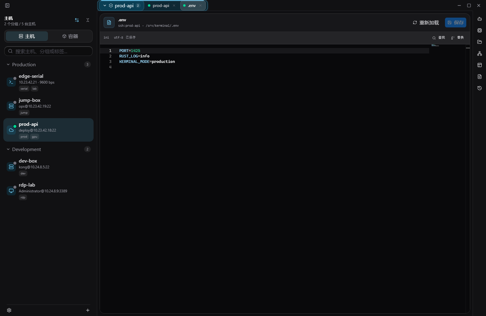
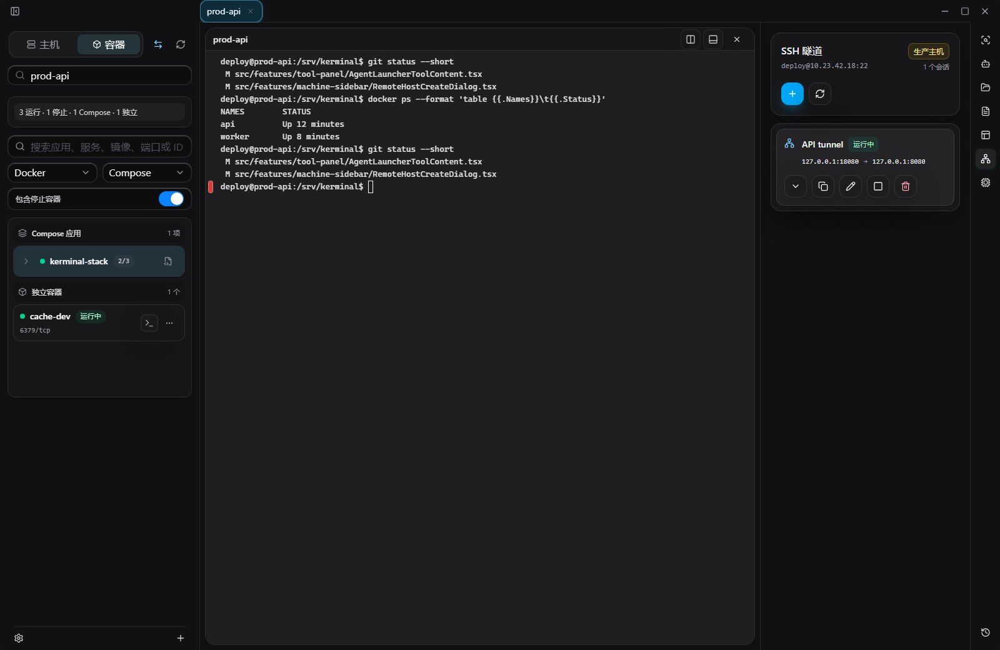
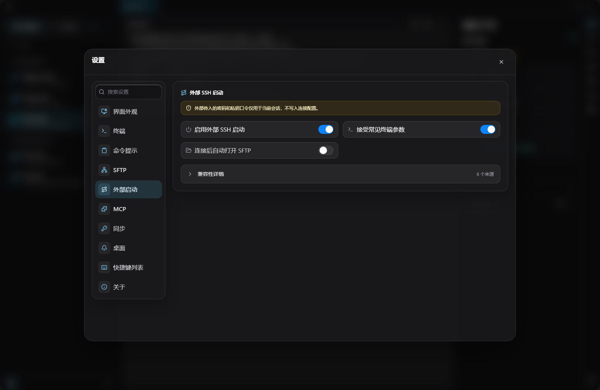

<div align="center">
  
  <h1>Kerminal</h1>
  <p><strong>SSH、终端、容器、文件、端口和 Agent，都在一个本地工作台里。</strong></p>
  <p>
    <sub>Managed SSH Runtime · GPU Terminal · Docker / Compose · SFTP · tmux · Port Forward · Agent CLI · MCP</sub>
  </p>
</div>


Kerminal 不是“又一个终端”。它把远程机器的上下文留在同一个桌面空间里：左边是目标，中间是工作区，右边是工具。你可以围绕同一个 SSH 目标打开终端、文件、容器、端口、系统状态和 Agent 会话。

## 为什么强

| 能力 | 你得到什么 |
| --- | --- |
| 受管 SSH runtime | 终端、SFTP、exec、tmux、系统信息、容器、端口转发和 MCP tools 复用同一套认证、host key、跳板链与隔离 channel |
| GPU 终端 | CPU / GPU / Auto renderer，适合高输出日志、构建、训练和远程排障 |
| 中央工作区 | 多 tab、多分屏、拖动重排、SFTP 传输 Tab、可编辑文件 Tab，不再在窗口之间找上下文 |
| 运维工具跟随目标 | Docker / Podman / Compose、tmux、系统/GPU 状态、端口转发、SFTP 都围绕当前机器工作 |
| Agent 可控接入 | Codex、Claude Code / Claude CLI、自定义 CLI 以终端 Tab 为边界启动，Kerminal MCP Server 只暴露运行态工具 |
| 外部 SSH 兼容入口 | PuTTY、MobaXterm、Xshell、SecureCRT、OpenSSH、URL/JSON/flags 可把 SSH 目标交给 Kerminal，形成临时 `external:*` 目标 |

## 最新界面

### 终端工作区

一个目标，一组上下文。终端、分屏、命令输出、文件和工具都围绕当前机器组织。


### 容器与 Compose

左栏切到“容器”，选择 SSH 主机后直接看 Docker / Podman / Compose。日志、详情、终端、文件和生命周期操作都在同一处。


### 文件与传输

SFTP 可以是右侧轻量浏览，也可以是中间长任务传输工作台。上传、下载、跨主机复制、队列、重试和预览都在一个流程里。


### 中央文件 Tab

远端文本、Compose YAML 和本地文件可以打开到中间编辑。支持保存、重载、dirty close guard 和冲突提示。



### 端口转发

Local、remote、dynamic forwarding 跟随当前 SSH 目标。running 前确认 listener / tunnel 状态，重启后状态不假装在线。



### Agent Launcher

Codex、Claude Code / Claude CLI 和自定义 CLI 作为一等终端会话启动。每个会话有自己的 workspace、目标绑定和 MCP 配置。


### 外部 SSH 兼容入口

从旧终端工具或跳板平台把 SSH 目标交给 Kerminal。该入口主要用于临时接入，会话凭据只在本次会话内使用，不写进主机配置。



### 系统与 GPU

CPU、内存、磁盘、网络、进程、运行体检和 GPU 摘要随当前目标刷新，适合开发、推理、训练和线上排障。


### tmux 与设置

tmux session、设置搜索、外部 SSH 启动、GPU renderer、SFTP 性能、MCP、快捷键和桌面集成都集中在右侧工具里。


## 能力一览

| 模块 | 支持 |
| --- | --- |
| 主机 | Local、SSH、RDP、Telnet、Serial、分组、标签、密码/私钥/agent、代理、跳板机、host key |
| 终端 | 多 tab、多分屏、批量发送、搜索、右键菜单、命令块导航、输出保护、GPU renderer |
| 文件 | SFTP 浏览、传输队列、远端复制、跨主机复制、远程预览、中央文件 Tab、本地文本读写 |
| 容器 | Docker / Podman / Compose 列表、日志、详情、终端、文件、启动、停止、重启、删除、固定 |
| 网络 | SSH local / remote / dynamic forwarding、本机 HTTP CONNECT proxy、远端 SOCKS、网络助手 |
| Agent | Codex、Claude Code / Claude CLI、自定义 CLI、session workspace、`AGENTS.md`、`.mcp.json`、Kerminal MCP tools |
| 配置 | `~/.kerminal` TOML 文件优先、encrypted vault、热刷新、validator、last-known-good |

## 本地运行

```powershell
npm install
npm run dev
```

桌面壳调试：

```powershell
npm run tauri:dev
```

生产前端构建：

```powershell
npm run build
```

刷新 README 截图：

```powershell
node scripts/capture-readme-screenshots.mjs http://127.0.0.1:<port>/
```

## 本地与安全

- 工作区、会话、主机、文件传输和设置默认保存在本机。
- 密码、内联私钥和 key passphrase 通过 encrypted vault 或 session-only secret 使用；`hosts/*.toml` 只保留引用。
- Kerminal MCP Server 只提供运行态工具。审批、权限和审计由外部 MCP host 负责。
- settings、profiles、hosts、snippets 和 workflows 以 `~/.kerminal` TOML 为事实源，外部 Agent 可以直接改文件并运行 validator。

## 适合谁

- 同时操作本机、云服务器、GPU 机器、容器、开发板、串口设备，也需要兼容堡垒机或旧 SSH 工具的人。
- 想把终端、文件、监控、tmux、端口转发和容器收进一个本地工作台的人。
- 想让 Codex 或 Claude 参与排障和开发，但不想给它们无限 shell 和凭据权限的人。

## 开源协议

Kerminal 源代码以 GNU Affero General Public License v3.0 only（AGPL-3.0-only）授权，详见 [LICENSE](LICENSE)。

Kerminal 名称、Logo、图标、截图和其它品牌资产不随 AGPL 授权，未经许可不得用于表示官方版本、官方背书或造成来源混淆；详见 [TRADEMARKS.md](TRADEMARKS.md)。
