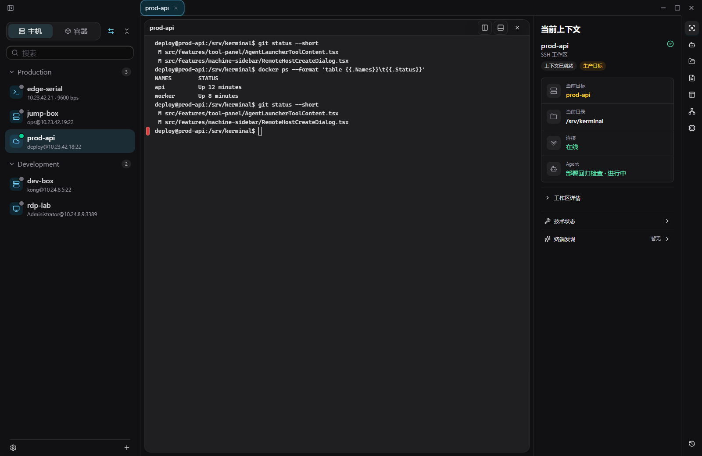
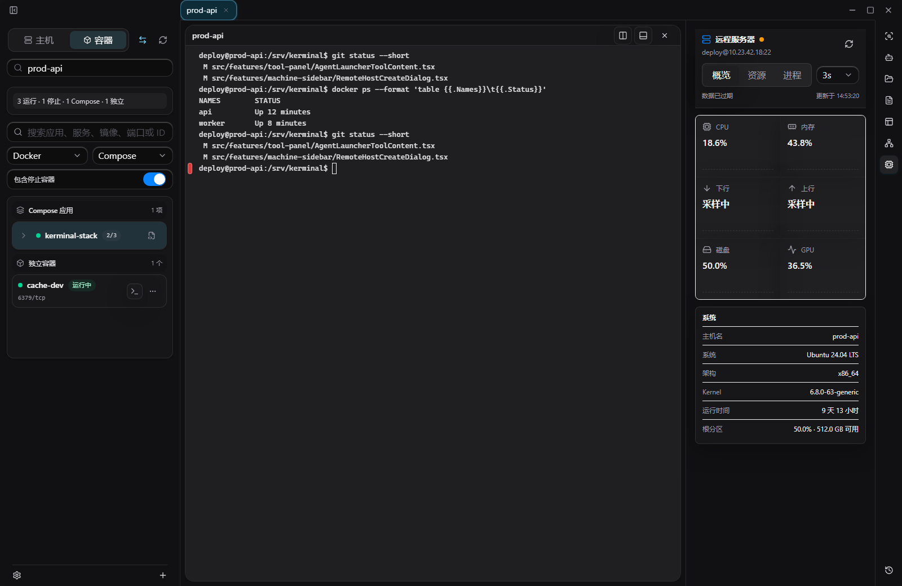

<!-- @author kongweiguang -->

<div align="center">
  
  <h1>Kerminal</h1>
  <p><strong>在一个桌面工作台中管理终端、远程服务器、文件、容器和 AI Agent。</strong></p>
  <p>
    <a href="https://github.com/kongweiguang/kerminal/releases">下载最新版</a>
    ·
    <a href="#快速开始">快速开始</a>
    ·
    <a href="#界面导览">界面导览</a>
    ·
    <a href="#主要功能">主要功能</a>
  </p>
</div>


Kerminal 是一个本地桌面终端、远程管理与 Agent 工作台。你可以连接本机或远程服务器，在同一个窗口中使用终端、传输文件、管理容器、查看系统状态，并启动 Codex、Claude Code 或自己的命令行 Agent。Agent 可以绑定当前终端目标，通过 Kerminal MCP 使用已经连接的运行态能力。

当前版本：**v0.3.7**

## 你可以用 Kerminal 做什么

- 连接本机、SSH、RDP、Telnet 和串口设备。
- 使用多标签、多分屏终端处理不同机器和任务。
- 启动 Codex、Claude Code 或自定义 Agent，并继续之前的会话。
- 将当前终端、命令块、选区和目标上下文发送给 Agent。
- 浏览、上传、下载和编辑远程文件。
- 管理 Docker、Podman、Compose 和容器内文件。
- 创建 SSH 端口转发，管理 tmux 会话。
- 查看服务器 CPU、内存、磁盘、网络、GPU 和进程状态。
- 搜索命令历史，管理带变量、风险等级和上下文绑定的命令片段。
- 通过 MCP 让外部 Agent 使用终端、SSH/SFTP、容器、tmux、端口转发和诊断能力。
- 从 PuTTY、MobaXterm、Xshell、SecureCRT 或 OpenSSH 打开连接。

## 安装

前往 [GitHub Releases](https://github.com/kongweiguang/kerminal/releases) 下载适合当前系统的安装包。

| 平台 | 安装包 |
| --- | --- |
| Windows x64 | NSIS 安装程序 |
| Linux x64 | AppImage、Deb |
| macOS Apple Silicon | App、DMG |
| macOS Intel | App、DMG |

macOS 安装包目前未使用 Apple Developer ID 签名和公证。如果将 Kerminal 拖入“应用程序”后仍被 Gatekeeper 阻止，可在终端运行以下命令移除 Kerminal 的隔离标记，然后重新打开：

```bash
sudo xattr -rd com.apple.quarantine /Applications/Kerminal.app
```

该命令只处理 Kerminal，不会全局关闭 Gatekeeper。执行前请确认应用来自本仓库的 GitHub Releases。

### 使用 Agent 前的准备

Kerminal 不捆绑 Codex 或 Claude 的账号和模型服务。使用对应 Agent 前，需要先在电脑上安装 CLI 并完成登录。

```powershell
codex --version
claude --version
```

只使用终端、SSH、SFTP、容器和服务器工具时，不需要安装 Agent CLI。

## 快速开始

### 1. 添加连接

点击左下角的添加按钮，选择连接类型并填写主机地址、端口、用户名和认证方式。


SSH 支持密码、私钥、SSH Agent、代理和跳板机。保存的密码与私钥口令会进入本地加密凭据库。

### 2. 打开终端

选择左侧主机即可创建终端。你可以新建多个标签页、拆分终端、搜索输出、复制命令块或同时向多个终端发送命令。

### 3. 启动 Agent

点击右侧的 Agent 图标，然后选择 Codex、Claude 或自定义命令。

Agent 会在独立的本地会话目录中启动，并可以绑定当前终端或远程目标。再次打开时，可以继续之前的会话，也可以新建会话。


你还可以在普通终端中选择内容或右击命令块，将内容发送到 Agent。发送前会显示预览，不会直接提交。

### 4. 查看当前上下文

“当前上下文”会显示正在操作的机器、目录、连接状态和关联 Agent，帮助你在多服务器、多标签和多会话之间确认当前目标。



## 界面导览

Kerminal 使用围绕当前目标组织的三栏工作台。左右栏都可以收起，让终端获得更多空间。

| 区域 | 用途 |
| --- | --- |
| 左侧主机栏 | 在主机与容器视图之间切换，按分组搜索和选择本机、SSH、RDP、Telnet、串口或容器目标；底部提供设置和添加入口。 |
| 中央工作区 | 使用终端标签页与多级分屏，也可以承载 SFTP 双面板传输和远程文件编辑标签页。 |
| 右侧工具栏 | 打开 Agent、当前上下文、系统信息、SFTP、端口转发、tmux、命令片段和日志。工具内容跟随当前主机、标签页或分屏目标。 |

界面支持浅色、深色和跟随系统主题；终端配色、字体、字号、行高、渲染模式和交互行为可以在设置中独立调整。

## 主要功能

### 终端与远程连接

- Local、SSH、RDP、Telnet 和 Serial。
- 多标签、多分屏、命令搜索、命令块和批量发送。
- SSH 密码、私钥、Agent、代理、跳板机和 host key 校验。
- GPU 终端渲染，并在不兼容或异常时自动回退。
- 命令、参数、路径、历史和 Git 引用建议。

### Agent 会话与 Kerminal MCP

Agent 不是悬浮在终端之外的聊天窗口，而是可以绑定当前机器、标签页或分屏的独立会话。Kerminal 为每个会话创建隔离工作区，保存目标绑定和必要的终端快照，并支持重命名、继续、同 Agent 新建会话、归档和删除本地记录。

- 支持 Codex、Claude Code 和自定义命令行 Agent。
- 可以从终端选区、命令块或当前上下文生成发送预览。
- Agent 忙碌时可以排队后续提示，并保留最近的发送历史。
- Kerminal 运行时 MCP 提供当前会话与目标、终端、SSH/SFTP、容器及容器文件、tmux、端口转发、服务器信息、命令历史和诊断工具。
- `kerminal.app_guide`、`kerminal.capabilities`、`kerminal.tool_help`、`kerminal.operation_guide` 和 `kerminal.runtime_snapshot` 帮助 Agent 发现界面入口、可用工具、调用顺序与当前运行状态。
- 工具确认、审批、权限和审计由 Codex、Claude Code 等 MCP host 负责；Kerminal 只暴露必须依赖正在运行应用和现有连接的能力。

### 文件与传输

SFTP 可以作为右侧文件浏览器使用，也可以打开为双面板传输工作台。


- 上传、下载、目录传输、远端复制和跨主机复制。
- 传输队列、进度、取消、失败重试和完成记录。
- 预览远程文件，或在中央文件标签页中编辑文本。
- 支持撤销、重做、查找、替换、重新加载和冲突覆盖保存。


### 容器与 Compose

连接服务器后，可以直接查看和管理 Docker、Podman 与 Compose。


- 查看容器、镜像、服务、状态和详细信息。
- 打开日志、终端和容器文件。
- 启动、停止、重启或删除容器。
- 上传、下载、创建、重命名和修改容器内文件。

### 服务器监控

系统工具提供“概览、资源、进程”三个视图，并支持手动或定时刷新。



- CPU、内存、磁盘、网络和 GPU 使用率。
- 操作系统、架构、Kernel、运行时间和存储信息。
- 网络上下行速率、资源趋势和进程列表。

### 端口转发

支持 SSH 本地转发、远程转发和动态 SOCKS 转发。转发规则跟随当前 SSH 主机显示和管理。


### tmux

可以查看、创建、连接、重命名、分离和关闭远程 tmux 会话。


### 命令片段与日志

右侧“片段”工具把内置命令、用户片段和命令历史组织为可搜索目录。片段可以带变量、默认动作、风险等级和目标上下文；发送前可以修改参数，并明确选择填入终端还是执行。

- 从当前命令或命令历史创建个人片段，也可以克隆内置片段后再编辑。
- 片段配置保存在 `~/.kerminal/snippets/*.toml`，支持外部编辑、目录打开和加载校验。
- “日志”工具展示本地应用日志状态、诊断包入口和当前终端的命令历史；支持按来源筛选、搜索和清理记录。

### 配置工作区与同步

Kerminal 的长期配置保存在 `~/.kerminal`，适合用户或外部 Agent 使用普通文件工具维护：

```text
settings.toml
profiles/*.toml
hosts/groups.toml
hosts/*.toml
snippets/*.toml
workflows/*.toml
```

配置规则由工作区内生成的 `kerminal-config.md` 和 MCP `kerminal.config_guide` 提供。修改后可以运行 validator；设置、Profile、主机、片段和工作流不会通过 MCP CRUD 管理。Workspace Sync 可以同步可移植配置，并排除 vault key、备份、事务恢复文件等本机私有数据。

### 外部 SSH 工具兼容

Kerminal 可以接收来自 PuTTY、MobaXterm、Xshell、SecureCRT、OpenSSH、URL 或命令行参数的连接信息。


### 个性化设置

设置页可以调整界面主题、终端主题与字体、CPU/GPU 渲染、命令提示、SFTP、外部启动、MCP、配置同步、桌面通知、快捷键和自动更新，并查看终端与受管 SSH 的脱敏运行诊断。


## 数据与安全

- 主机、会话、传输记录和设置默认保存在本机。
- 密码、私钥口令等敏感信息保存在本地加密凭据库中。
- Agent 会话使用独立目录，不会把不同会话的上下文混在一起。
- 向 Agent 发送终端内容前需要经过预览。
- 删除 Kerminal 中的 Agent 会话记录，不会删除 Codex 或 Claude 服务商保存的历史。
- 主机 TOML 只保存 `secret_ref`、`key_passphrase_ref` 等凭据引用，不写入密码、私钥正文或私钥口令。
- Workspace Sync 不提交 vault key、备份和事务恢复文件。
- 远程写入、覆盖、删除、停止等操作会使用对应的确认流程。

## 常见问题

### 点击 Codex 或 Claude 后无法启动

先在系统终端中确认对应命令可以运行，并完成 CLI 登录。然后重新打开 Kerminal。

```powershell
codex
claude
```

### Agent 是否会自动获得所有服务器权限

不会。Agent 只使用当前会话绑定的目标和 Kerminal 提供的运行能力；目标断开或会话失效后需要重新连接。

### 可以只把 Kerminal 当作终端工具使用吗

可以。Agent、容器、SFTP、端口转发和服务器监控都是独立入口，可以按需使用。

### 配置和数据保存在哪里

默认保存在当前用户目录下的 `~/.kerminal`。卸载或迁移前，可以先备份该目录。

## 源码开发

仓库统一使用 `pnpm@10.33.0`。准备 Node.js 20+、Rust stable 和 Tauri 对应平台依赖后运行：

```powershell
corepack enable
pnpm install --frozen-lockfile
pnpm run dev
```

桌面开发与生产构建分别使用 `pnpm run tauri:dev` 和 `pnpm run build`。

## 开源协议

Kerminal 源代码以 GNU Affero General Public License v3.0 only（AGPL-3.0-only）授权，详见 [LICENSE](LICENSE)。

Kerminal 名称、Logo、图标、截图和其它品牌资产不随 AGPL 授权，详见 [TRADEMARKS.md](TRADEMARKS.md)。
