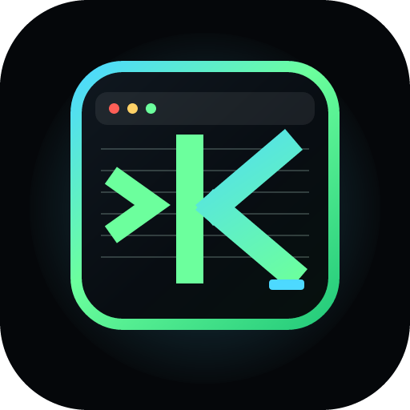
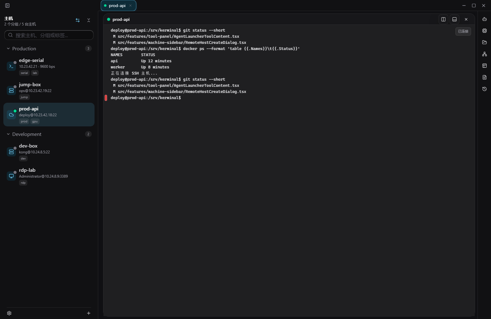
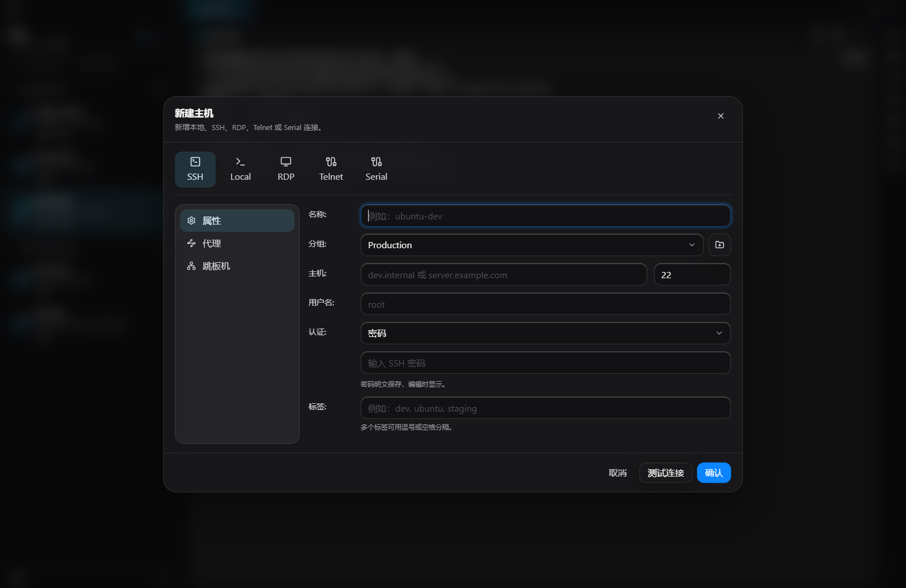
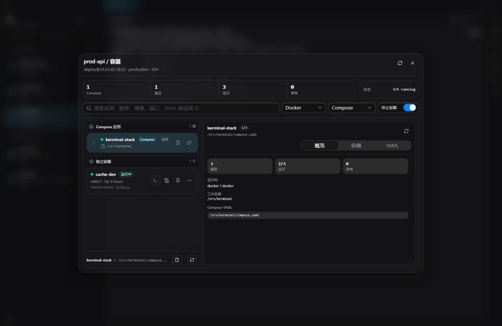
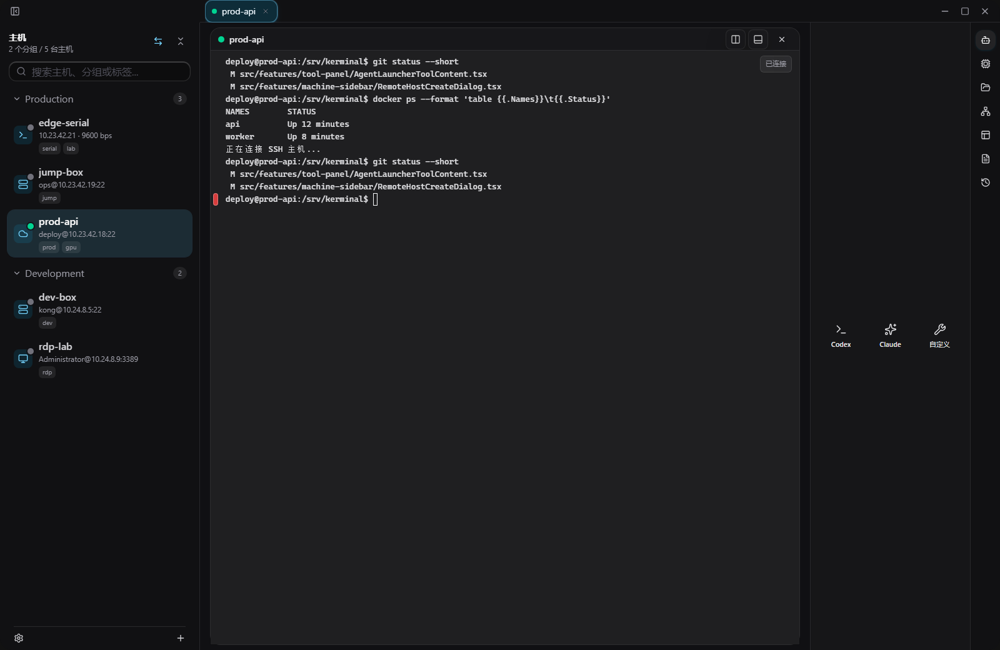
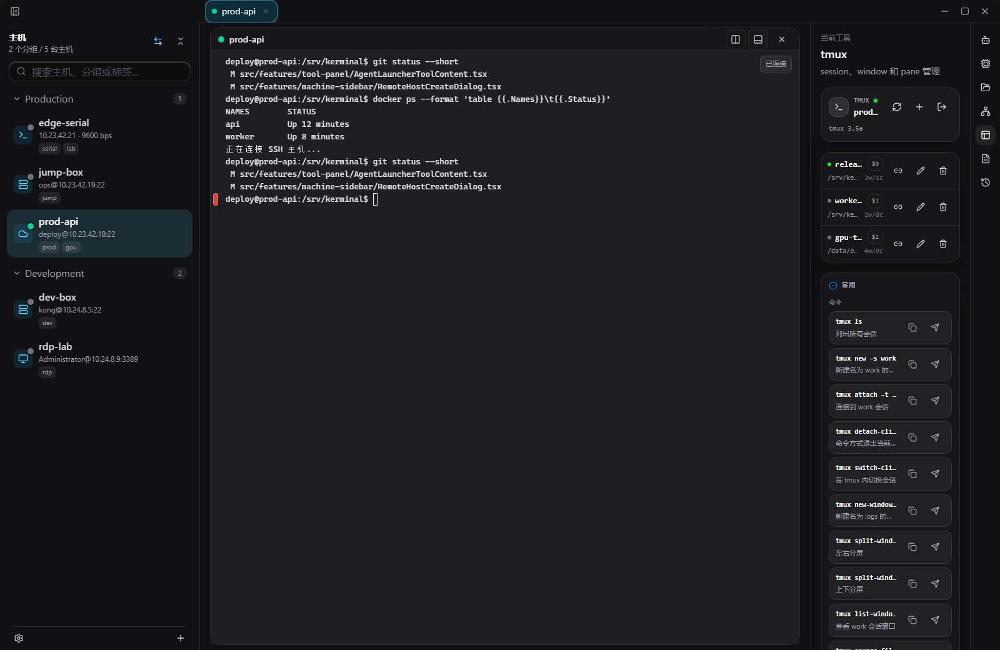
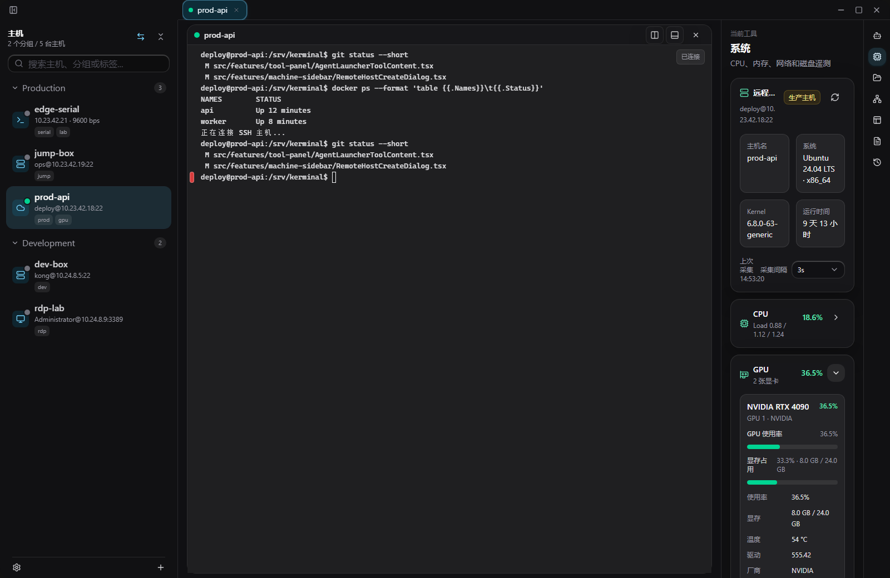
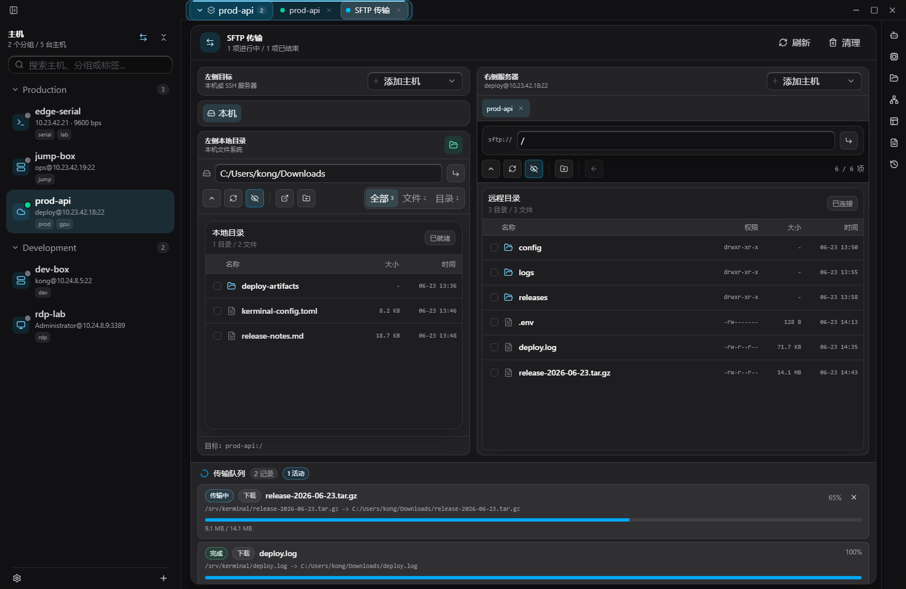
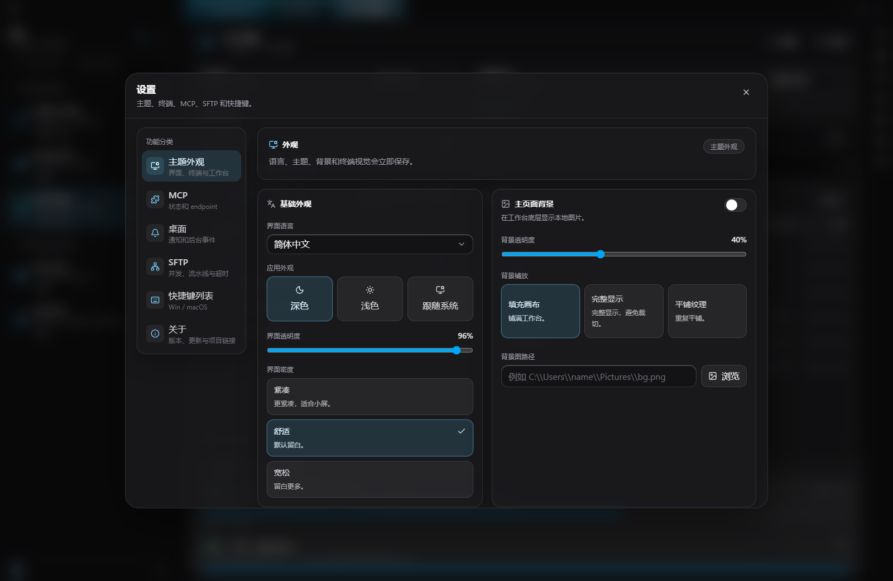

<div align="center">
  
  <h1>Kerminal</h1>
  <p><strong>一个本地优先的多机器终端工作台。</strong></p>
  <p>
    <sub>Terminal · SSH · tmux · Docker / Compose · RDP · SFTP · Port Forwarding · Agent Launcher · Kerminal MCP Server</sub>
  </p>
</div>



Kerminal 把主机、终端、tmux、容器、文件传输、端口转发、系统状态、命令片段、工作流和外部 Agent 放在同一个桌面工作区里。它的核心不是“多开几个终端”，而是围绕当前目标机器保留上下文、减少来回切换，并让 Codex、Claude 或自定义 CLI 通过 Kerminal MCP Server 受控参与工作。

## 最新入口

| 区域 | 当前行为 |
| --- | --- |
| 主机侧边栏 | 添加 Local、SSH、RDP、Telnet、Serial；分组、标签、认证和跳板机都从这里管理 |
| Docker / Compose | 不在“新增主机”里添加；右击某个 SSH 主机，选择“容器”进入该主机的 Docker/Podman/Compose 管理 |
| 工作区中间 | 多 tab、多分屏、终端命令块、pane 拖动重排/交换、批量发送和输出保护 |
| 右侧工具栏 | Agent Launcher、系统、文件、端口、tmux、片段、日志、设置 |
| 文件型配置 | `~/.kerminal` 下的 TOML 是事实源；settings/profile/host/snippet/workflow 外部写入后自动刷新 |

## 快速上手

1. 点左下角 `+` 添加 Local、SSH、RDP、Telnet 或 Serial 目标。
2. 打开 SSH 主机后，在中间工作区分屏看日志、跑命令；拖动 pane 标题栏可以移动或交换分屏位置。
3. 需要容器时，右击左侧 SSH 主机，打开“容器”；Compose 项目会按应用折叠，展开后查看服务容器、YAML、日志和固定入口。
4. 远端已有 tmux 时，打开右侧 `tmux` 工具，直接 attach 到现有 session，或为当前目标新建持久会话。
5. 用右侧“文件”做 SFTP 上传下载、远端复制和跨服务器传输；用“端口”管理 local/remote/dynamic SSH 隧道。
6. 打开 Agent Launcher 启动 Codex、Claude 或自定义 CLI。每个 Agent 默认进入独立会话目录 `~/.kerminal/agents/sessions/<agentSessionId>`，并通过 session-scoped MCP 配置访问 Kerminal 运行态工具。

## 当前界面

这些截图来自当前运行界面采集，按真实使用路径排列。Docker / Compose 的入口在 SSH 主机右键菜单，不在新增主机弹窗里。

### 连接管理

新增主机只负责 Local、SSH、RDP、Telnet 和 Serial。容器属于已连接主机的上下文能力。



### 主机右键容器管理

从左侧 SSH 主机右键打开“容器”，可以查看 Docker/Podman 容器和 Compose 应用。Compose 项目支持应用折叠、服务容器展开、只读 YAML、日志入口、轻量状态和固定到侧栏。



### Agent Launcher

右侧工具栏直接启动 Codex、Claude 或自定义 CLI。Kerminal 不内置模型 provider；外部 Agent 自己负责工具批准、权限和审计，Kerminal MCP Server 只提供受控运行态 tools。



### tmux 会话

当前目标支持 tmux 时，右侧面板会显示版本、session 列表、attach 命令、创建/重命名/结束会话和常用 prefix 快捷键。



### 系统状态

系统面板围绕当前目标展示 CPU、内存、磁盘、网络、进程、运行体检和 GPU 摘要，适合开发、推理、训练和远程排障。



### 文件传输

SFTP 工作台支持双栏浏览、上传下载、远端复制、服务器到服务器跨主机复制、冲突预检、传输队列和远程文本预览。



### 设置

设置集中管理主题、界面密度、终端外观、Kerminal MCP Server、外部 Agent 工作目录、桌面剪贴板/通知/日志、SFTP 和快捷键。



## 能力地图

| 能力 | 用户得到什么 |
| --- | --- |
| 多协议主机 | Local、SSH、RDP、Telnet、Serial；支持分组、标签、密码/私钥/agent、代理、跳板机和连接检查 |
| 终端工作台 | 多标签、多分屏、pane 拖动重排/交换、批量发送、命令块色条导航、搜索、右键菜单、断开重连和输出保护 |
| tmux 管理 | 当前目标 tmux 探测、版本展示、session 列表、attach 命令、创建/重命名/结束/Detach、prefix 快捷键速查 |
| 容器操作 | SSH 主机右键 Docker/Podman 容器列表、Compose 项目折叠/展开、服务容器分组、只读 Compose YAML、进入终端、固定到侧栏、启动/停止/重启/删除、详情、日志和容器文件 |
| 文件操作 | SFTP 双栏浏览、上传下载、目录传输、远端复制、跨主机复制、ZIP 上传/下载、冲突策略、传输队列、远程文本预览和远程工作区编辑 |
| 网络与隧道 | SSH local/remote/dynamic forwarding、主机网络助手、本机受管 HTTP CONNECT proxy、远端 SOCKS、无外网主机借本机网络出口 |
| 机器观测 | CPU、核心占用、内存、Swap、磁盘、网络接口、进程、运行体检、诊断包、GPU 名称/驱动/显存/占用/温度 |
| 外部 Agent 协作 | Codex、Claude、自定义 CLI；会话级 `AGENTS.md` / `CLAUDE.md` / `.codex/config.toml` / `.mcp.json`；Kerminal MCP Server 提供终端、SSH/SFTP、容器、端口转发、服务器信息和诊断工具 |
| 配置与热刷新 | `~/.kerminal` 下 settings、profiles、hosts、snippets、workflows 文件优先；外部写入自动刷新；坏 TOML 保持 last-known-good；validator 暴露给外部 Agent |
| 桌面集成 | Tauri window-state、single-instance、原生文本剪贴板、系统通知、应用日志和最小 capability 配置 |

## 本地运行

```powershell
npm install
npm run dev
```

桌面壳调试：

```powershell
npm run tauri:dev
```

生产前端构建：

```powershell
npm run build
```

刷新 README 截图时，先启动 dev server，再运行：

```powershell
node scripts/capture-readme-screenshots.mjs http://127.0.0.1:<port>/
```

## 本地边界

Kerminal 是本地桌面应用，默认把工作区状态、会话、主机、文件传输和设置保存在本机。当前 SSH 密码和内联私钥随远程主机记录明文保存和展示，用于 SSH、SFTP、Docker 容器、端口转发、命令建议和 Kerminal MCP 工具执行路径复用同一份认证信息。

Kerminal MCP Server 面向 Codex、Claude 和其它 MCP host 时只提供运行态 tools。生产主机、破坏性命令、远程写操作、文件删除和外部发布的批准流程由外部 Agent host 负责；Kerminal 只做工具目录、参数边界、loopback/Host 校验和输出脱敏。

文件优先版本不自动读取或迁移早期一体化 SQLite 数据库。升级前如需保留旧数据，请先备份应用数据目录；新版本以 TOML 配置文件和命令域 SQLite 作为当前事实源。settings、profiles、hosts、snippets 和 workflows 的人工/Agent 修改都应直接落到 `~/.kerminal` 文件，再用 validator 校验。

## 适合谁

- 经常同时操作本机、跳板机、云服务器、GPU 机器、容器、开发板和串口设备的人。
- 希望把终端、文件、监控、脚本、tmux 和端口转发收进同一个本地工作台的人。
- 想让 Codex、Claude 或自定义 CLI 通过受控工具参与排障和开发，但不想给它们无限 shell/凭据权限的人。

## 设计取向

Kerminal 追求的是克制、密度和可控。主机在左，工作区在中间，工具在右；高频操作贴近当前目标，复杂环境不再把上下文打散。

## 开源协议

Kerminal 源代码以 GNU Affero General Public License v3.0 only（AGPL-3.0-only）授权，详见 [LICENSE](LICENSE)。

Kerminal 名称、Logo、图标、截图和其它品牌资产不随 AGPL 授权，未经许可不得用于表示官方版本、官方背书或造成来源混淆；详见 [TRADEMARKS.md](TRADEMARKS.md)。
