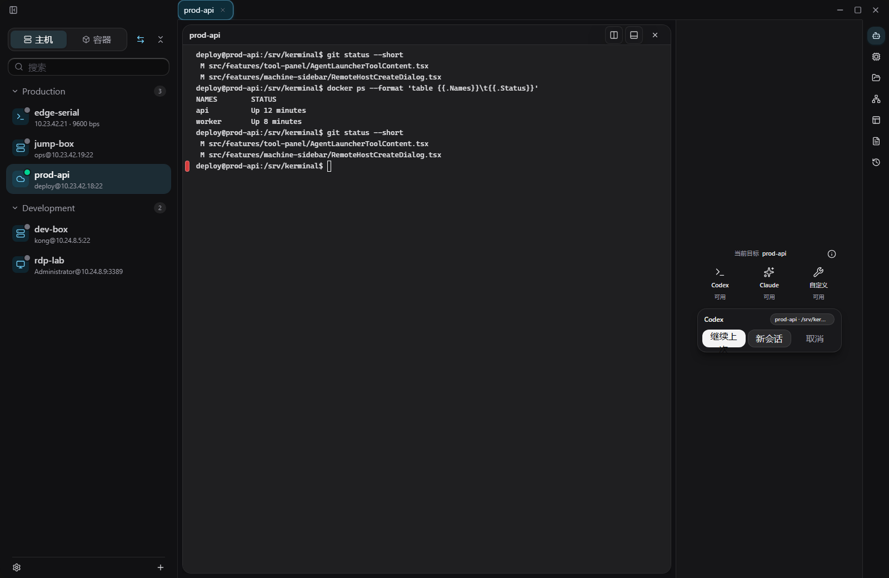

<div align="center">
  
  <h1>Kerminal</h1>
  <p><strong>让 Codex、Claude 和你的远程目标在同一个本地工作台里协作。</strong></p>
  <p>
    <sub>Agent Workspace · Target Binding · Runtime MCP · Managed SSH · GPU Terminal · Docker / Compose · SFTP · tmux</sub>
  </p>
</div>


Kerminal 不是内置聊天，也不是把一个 Agent 丢进无边界 shell。它把目标机器、终端工作区、文件、容器、端口、系统状态和外部 Agent CLI 放进一个本地桌面应用。先选定真实目标，再启动 Codex、Claude 或自定义 CLI；Agent 在自己的会话工作区内协作，并通过受控的 Kerminal MCP 读取和操作运行态。

## 为 Agent 保留真实上下文

| 能力 | 你得到什么 |
| --- | --- |
| Agent 会话 | Codex、Claude 和自定义 CLI 按终端 Tab 隔离；切换 Tab 不混淆会话，关闭 Tab 时归档对应 Agent session |
| 目标绑定 | Agent 可以绑定当前 SSH、容器或本地终端目标，保留目标类型、终端 Tab、pane、工作目录和 shell 上下文 |
| 会话工作区 | 每个 Agent session 都有独立工作目录、`AGENTS.md` / `CLAUDE.md`、MCP 配置和目标快照，方便恢复和审计当前任务 |
| 运行态 MCP | Kerminal MCP Server 只提供 live app、终端 session、SSH/SFTP、容器、端口转发、服务器信息和诊断等运行态能力 |
| 人在控制环 | 外部 MCP host 负责审批、权限、hook 和审计；凭据保留在 encrypted vault 或 session-only secret，不暴露给 Agent 配置 |
| 同一个远程运行时 | terminal、SFTP、exec、tmux、容器、端口转发、系统信息和 MCP tools 复用受管 SSH 认证与路由，并保持独立 channel |

## AI 工作流

1. 在左侧选择本机、SSH、容器或其它目标，在中间保留真实终端与文件上下文。
2. 在右侧启动 Codex、Claude 或自定义 CLI。Kerminal 创建对应的 session workspace，并把当前目标绑定给该会话。
3. Agent 通过 Kerminal MCP 查询或操作运行态；常规 settings、profiles、hosts、snippets 和 workflows 继续以 `~/.kerminal` 文件为事实源。
4. 继续使用终端、SFTP、容器、tmux、端口转发和诊断工具完成实际工作，不需要在多个窗口和临时上下文之间来回切换。

### Agent Launcher

当前目标、Codex、Claude、Custom CLI 与运行态 MCP 信息都放在同一个右侧工具位。技术详情会显示当前 MCP 服务和 Agent 配置状态。


### 会话恢复与目标绑定

已有 Agent session 可以继续或新开，并显示它最后绑定的目标状态。绑定会随目标断开而失效，重新操作时由 Kerminal 重新解析或重绑，不会被宣传为永久授权。



## Agent 之外，仍是完整的远程工作台

### 终端工作区

一个目标，一组上下文。多 tab、多分屏、命令输出、文件、智能命令建议和右侧工具都围绕当前机器组织。

### 容器与 Compose

选择 SSH 主机后直接看 Docker / Podman / Compose。日志、详情、终端、文件和生命周期操作都在同一处，并能沿用当前目标的认证和路由。


### 文件、传输与中央编辑

SFTP 可以是右侧轻量浏览，也可以是中间长任务传输工作台。上传、下载、跨主机复制、队列、重试、预览和远端文本编辑都保留在同一流程。


### 端口、系统与 tmux

Local、remote、dynamic forwarding 跟随当前 SSH 目标。系统/GPU 摘要、tmux session 和运行体检也在同一个目标上下文中刷新，适合开发、推理、训练和线上排障。


### 外部 SSH 兼容入口与设置

PuTTY、MobaXterm、Xshell、SecureCRT、OpenSSH、URL、JSON 和 flags 可把 SSH 目标交给 Kerminal，形成 session-only 的临时 `external:*` 目标。设置集中管理外部启动、GPU renderer、SFTP 性能、MCP、快捷键和桌面集成。


## 能力一览

| 模块 | 支持 |
| --- | --- |
| 主机 | Local、SSH、RDP、Telnet、Serial、分组、标签、密码/私钥/agent、代理、跳板机、host key |
| 终端 | 多 tab、多分屏、批量发送、搜索、右键菜单、命令块导航、输出保护、GPU renderer、命令建议 |
| 文件 | SFTP 浏览、传输队列、远端复制、跨主机复制、远程预览、中央文件 Tab、本地文本读写 |
| 容器 | Docker / Podman / Compose 列表、日志、详情、终端、文件、启动、停止、重启、删除、固定 |
| 网络 | SSH local / remote / dynamic forwarding、本机 HTTP CONNECT proxy、远端 SOCKS、网络助手 |
| Agent | Codex、Claude Code / Claude CLI、自定义 CLI、tab 级 session、目标绑定、session workspace、`AGENTS.md`、`.mcp.json`、运行态 MCP tools |
| 配置 | `~/.kerminal` TOML 文件优先、encrypted vault、热刷新、validator、last-known-good |

## 本地运行

```powershell
npm install
npm run dev
```

桌面壳调试：

```powershell
npm run tauri:dev
```

生产前端构建：

```powershell
npm run build
```

刷新 README 截图：

```powershell
node scripts/capture-readme-screenshots.mjs http://127.0.0.1:<port>/
```

## 本地与安全

- 工作区、会话、主机、文件传输和设置默认保存在本机。
- 密码、内联私钥和 key passphrase 通过 encrypted vault 或 session-only secret 使用；`hosts/*.toml` 只保留引用。
- Kerminal MCP Server 只提供运行态工具。审批、权限、hook 和审计由外部 MCP host 负责。
- settings、profiles、hosts、snippets 和 workflows 以 `~/.kerminal` TOML 为事实源；外部 Agent 可以编辑工作区文件并运行 validator，而不是通过 MCP 做常规配置 CRUD。

## 适合谁

- 想让 Codex、Claude 或自己的 Agent CLI 参与远程开发、运维和排障，但仍希望目标、权限与凭据边界可见的人。
- 同时操作本机、云服务器、GPU 机器、容器、开发板和串口设备，也需要兼容堡垒机或旧 SSH 工具的人。
- 想把终端、文件、监控、tmux、端口转发、容器和 Agent session 收进一个可持续使用的本地工作台的人。

## 开源协议

Kerminal 源代码以 GNU Affero General Public License v3.0 only（AGPL-3.0-only）授权，详见 [LICENSE](LICENSE)。

Kerminal 名称、Logo、图标、截图和其它品牌资产不随 AGPL 授权，未经许可不得用于表示官方版本、官方背书或造成来源混淆；详见 [TRADEMARKS.md](TRADEMARKS.md)。
